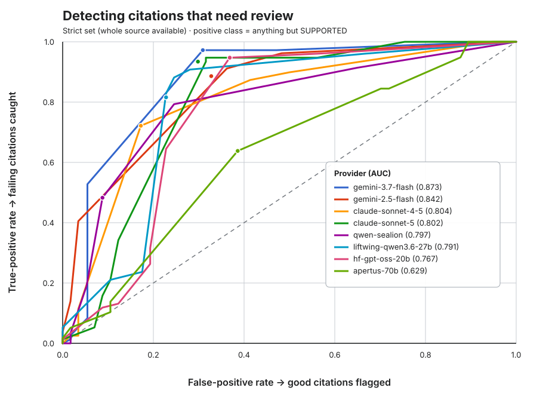

# What does “supported” mean? A measurement framework for citation verification

A citation checker makes two distinct promises. First, it assigns a useful label
to the relationship between a claim and its source. Second, it helps editors find
the citations that deserve attention without sending them through too many false
alarms. Those promises need different measurements.

This note defines the labels used by the citation checker, identifies the places
where reasonable reviewers can disagree, and introduces three complementary
views of performance: **strict accuracy**, **supported-versus-everything-else
accuracy**, and the **ROC curve**.

## The unit being judged

The tool judges the relationship between a specific Wikipedia claim and the text
of the source cited for it. It does not decide whether the claim is true in the
world, whether the source is generally reliable, or whether a different source
could support it. The question is narrower:

> Does the supplied source text support this claim as Wikipedia states it?

This distinction matters. A true claim can be unsupported by the cited source,
and an accessible, reputable source can simply fail to contain the relevant
fact. For adjacent citations that are evaluated together, the same definitions
apply to the sources collectively: different sources may support different parts
of one claim.

## The four verdicts

| Verdict | Definition | What it means for an editor |
|---|---|---|
| **Supported** | The usable source backs every material part of the claim, allowing ordinary paraphrase and straightforward implication. A factual statement requires evidence stated with comparable certainty. | No citation problem was detected. |
| **Partially supported** | The source backs some, but not all, material parts of the claim, or its wording is materially more qualified than the claim. | Inspect the gap; revise the claim or find additional sourcing. |
| **Not supported** | The source is usable but either contradicts the claim or does not address it. These are recorded as `contradiction` and `omission` respectively. | The citation does not do the job assigned to it. |
| **Source unavailable** | No usable article or book content was supplied—for example, only a login page, paywall notice, catalog record, error page, or retrieval-failure message is present. | Retrieve or inspect the source before judging support. |

“Source unavailable” is not a judgment that the claim lacks support. It says the
tool lacks the evidence needed to make that judgment. Conversely, archive chrome,
headers, or cookie notices do not make a source unavailable when substantive
article text is also present.

## Where the boundaries blur

The labels are deliberately useful, but they are not laws of nature. Several
boundaries require judgment:

### Supported ↔ partially supported

This is often the hardest boundary. Reviewers must decide which details are
*material*, which inferences are straightforward, and whether a difference in
certainty changes the meaning. A source saying “is believed to have happened”
does not fully support a claim saying it happened. A source confirming growth
without confirming the claim's exact percentage supports the direction, but not
the whole claim. Transliteration variants and faithful paraphrases, by contrast,
are not factual gaps.

### Partially supported ↔ not supported

A multi-part claim with one substantiated part is normally partially supported;
a source that addresses none of the claim is not supported. The difficult cases
are claims whose remaining supported fragment is incidental, or where one part
is directly contradicted. The tool treats contradiction as the reason when a
source both contradicts one part and omits another, but reviewers can still
disagree about whether the claim as a whole retains enough support to be called
partial.

### Not supported ↔ source unavailable

Absence of evidence is meaningful only when there was usable evidence to search.
A full article about the relevant subject that never mentions the asserted fact
can justify “not supported—omission.” A sign-in screen cannot. Extraction errors,
truncation, and pages dominated by navigation can make this line especially hard
to draw.

### Why preserve the distinctions?

The four labels describe different failure modes and different next actions.
Keeping them lets us diagnose whether a model is overly cautious, misses partial
gaps, confuses omission with access failure, or makes some other systematic
error. But an editor triaging a queue may only need to know whether a citation
can safely pass or needs another look. That is why the framework reports both a
four-way and a two-way metric.

## Worked examples

The examples below show the decision being measured, not whether the underlying
claim is true in the world. Short source excerpts are used so the decisive
relationship is visible. The first two tables are deliberately compact,
illustrative cases based on the verifier's current rules; the following section
uses observed benchmark results dated 6 September 2026.

### Individual citation checks

An individual check compares one claim with one cited source.

| Verdict | Claim | What the supplied source says | Why |
|---|---|---|---|
| **Supported** | “Acme Corp was founded in 1985 by John Smith.” | “Acme Corp was established in 1985. Its founder, John Smith, served as CEO until 2001.” | Every material element is present; “established” is an ordinary paraphrase of “founded.” |
| **Partially supported** | “The population increased by 12% between 2010 and 2020.” | “Census data shows significant population growth in the region during the 2010s.” | The direction and period are supported, but the precise 12% figure is not. |
| **Not supported — contradiction** | “The bridge was completed in 1998.” | “The bridge was finally opened to traffic in August 2002.” | The usable source gives an incompatible year. |
| **Not supported — omission** | “She received the Nobel Prize in Chemistry in 2015.” | A substantive biography describes her education, career, publications, and teaching awards but never mentions a Nobel Prize. | The source is usable and relevant enough to inspect, but it does not address the asserted award. |
| **Source unavailable** | “The committee published its findings in 1932.” | A Google Books sign-in page containing navigation and bibliographic metadata, but no book text. | There is no usable source content against which to judge the claim. This is not the same as an omission in an accessible book. |

These examples also show why “not supported” has two reason types. A
contradiction has a decisive passage to quote. An omission normally has no such
passage—the absence is the problem—while “source unavailable” means the tool
never had a usable document to search.

### Group checks

A group check evaluates adjacent citations attached to the same claim. The tool
still shows the individual results, but the **collective verdict** is the
headline used for filtering and reporting. It asks whether the sources support
the claim *together*; it must not count one failure per source when the citations
were intended to divide the evidentiary work.

| Collective verdict | Claim and individual checks | Why the group receives that verdict |
|---|---|---|
| **Supported** | Claim: “Acme Corp was founded in 1985 by John Smith, who led it until 2001.” Source A supports the 1985 founding but not the founder or tenure; Source B supports Smith as founder and his tenure but gives no year. Each individual check is **Partially supported**. | The two sources cover every material element when read together. Reporting two citation failures would be a false positive. |
| **Partially supported** | Claim: “The bridge, built in 1998, cost $200 million.” Source A supports the 1998 opening; Source B discusses funding but gives no total cost. | The group supports the date but no source supplies the $200 million figure. |
| **Not supported** | Claim: “The treaty was signed in Paris in 1990.” One usable source says it was signed in Brussels in 1991; the other discusses negotiations but gives no signing place or year. | Taken together, the sources contradict the material details rather than filling one another's gaps. |
| **Source unavailable** | Both citations resolve only to a paywall notice and a catalog record with no article or book text. | None of the group's sources contains usable content. If even one source contained substantive text, the group would be judged against that text instead of being called unavailable. |

The supported group is an important boundary case: a per-source result can be
correct in isolation and still become a **false positive at the claim level** if
it is presented as the group's final result.

### Recent false positives

In this framework, a false positive means the tool flags a citation that the
human ground truth labels **Supported**. These are real examples from the
benchmark run recorded on 6 September 2026; they are included to make clear that
false positives can arise from defensible boundary judgments, not only obvious
model failures.

| Article and check | Human label → model prediction | Why it was flagged; why it counts as a false positive |
|---|---|---|
| *F5ve*: a claim gives the announcement date, title, and release date of *Sequence 01.5*. | **Supported → Partially supported** | The model found the 14 November release date but said the excerpt did not give the 4 November announcement date or full subtitle. Under the benchmark's human label the citation is supported, so the stricter prediction is nevertheless a measured false positive. |
| *Tim Kask*: the claim says he died after a short illness on 30 December 2025, aged 76. | **Supported → Not supported** | The model focused on “sudden” versus “short” illness and on the source saying “last night” rather than printing the date. The ground truth accepts the citation, making this another false alarm at the supported/review boundary. |
| *Marjane Satrapi*: the cited claim is an ISBN. | **Supported → Not supported** | The model treated the supplied Goodreads text as lacking the ISBN and returned an omission. Because the benchmark label is Supported, this is scored as a false positive and also suggests checking whether source extraction omitted visible page metadata. |

False positives should therefore be reviewed rather than automatically dismissed:
they may reveal an over-literal model, a genuine ambiguity in “fully supported,”
an extraction problem, or a ground-truth label worth auditing. For a group, the
first question should always be whether other citations in the same adjacent
group supply the apparently missing fact.

## Metric 1: strict accuracy

**Strict accuracy**—called `exactAccuracy` in the benchmark output—is the share
of predictions that exactly match the human ground-truth verdict:

```text
strict accuracy = exact four-way matches / scoreable predictions
```

A prediction of “partially supported” is wrong when the reference label is “not
supported,” even though both would send the citation to review. The same is true
for “source unavailable.” This is the right metric for testing whether the tool
preserves the meaning of the full verdict vocabulary. It is unforgiving by
design, and therefore sensitive to the blurry boundaries above and to mistakes
in the human labels.

Here, **strict accuracy** should not be confused with the benchmark's **strict
set**. The former is a scoring rule; the latter is the subset where the stored
source is the whole document rather than text cut off at a fetch limit. Any
metric can be calculated on the strict set.

## Metric 2: supported versus everything else

For the tool's triage decision, the four labels collapse into two groups:

```text
PASS:         Supported
NEEDS REVIEW: Partially supported, Not supported, Source unavailable
```

**Supported-versus-everything-else accuracy** is the share of predictions on the
correct side of that boundary. Confusing “partially supported” with “not
supported” does not count as an error; confusing either with “supported” does.
“Source unavailable” belongs in “needs review” because an editor still cannot
safely pass the citation without further work.

This metric answers the operational question the tool is built around: *did it
separate citations that can pass from citations that need attention?* It also
avoids pretending that the fuzzy distinctions among problem types are equally
important to the pass/review decision. It does **not** replace strict accuracy:
a model could achieve a good binary score while giving editors consistently
misleading explanations of what went wrong.

Accuracy alone can also hide asymmetric costs. In a dataset containing mostly
good citations, a model that nearly always says “supported” may look accurate
while missing the problems editors care about. For deployment, we therefore
also ask how many real problems are caught and how many good citations are
flagged unnecessarily.

## Metric 3: the ROC curve



The receiver operating characteristic (ROC) curve treats **needs review** as the
positive class. In this chart:

- **True-positive rate (vertical axis)** is the share of genuinely failing
  citations the tool catches. This is recall on the cases the tool exists to
  find.
- **False-positive rate (horizontal axis)** is the share of genuinely supported
  citations the tool flags anyway. This represents unnecessary editor work.
- **Each point** applies a different threshold to the model's failure score.
  Lowering the threshold flags more citations: it usually catches more real
  problems and creates more false alarms.
- **The dashed diagonal** represents no discriminating power. Curves that bow
  toward the upper-left corner are better; that corner means catching every
  problem with no false alarms.
- **AUC**, the area under the curve, summarizes ranking quality. An AUC of 1.0
  is perfect; 0.5 is chance. Equivalently, it is the probability that a randomly
  chosen failing citation receives a higher failure score than a randomly
  chosen supported citation.
- **The dot on each curve** is the provider's current raw-verdict operating
  point: every prediction other than “supported” is flagged, without adding a
  separate confidence cutoff.

The ROC curve does not select the “right” operating point. That depends on the
product decision. Moving upward usually means finding more defects; moving left
means interrupting fewer editors with sound citations. For a review queue where
false alarms are expensive, a leftward point may be preferable even at lower
recall. For a screening pass whose output is always reviewed, accepting more
false alarms may be worthwhile to miss fewer real problems.

AUC and accuracy answer different questions. Accuracy evaluates the verdicts the
provider actually emitted at its present operating point. AUC evaluates how well
its scores rank cases across *all* possible thresholds. A provider can therefore
have a strong AUC but mediocre strict accuracy, or vice versa. The chart uses the
strict set so that a missing passage caused by source truncation is not mistaken
for a model's failure to discriminate.

## How to use the framework

Read the measures together:

1. Start with **strict accuracy** to test fidelity to the complete four-verdict
   taxonomy.
2. Check **supported versus everything else** to test the pass/review decision
   that drives editor workflow.
3. Use the **ROC curve**, true-positive rate, and false-positive rate to examine
   the trade-off hidden by a single accuracy number and to choose an operating
   threshold appropriate to the cost of missed problems and false alarms.
4. Inspect the confusion matrix and disputed examples. Neither metric resolves
   ambiguous labels, dataset imbalance, source-extraction failures, or weak
   ground truth.

This is a first measurement framework, not a claim that the taxonomy is
finished. Its purpose is to make the value judgments explicit: what counts as
support, which distinctions matter for diagnosis, which distinctions matter for
triage, and what trade-off editors are being asked to accept.

## Reproducing the chart

The figure is generated from `benchmark/roc_strict.json`, which contains the
curve points, AUC values, class counts, and raw-verdict operating points for the
whole-source benchmark subset. Recompute that data from the current benchmark
results with:

```sh
cd benchmark
npm run roc:strict
```

The values shown are a snapshot, not permanent model rankings. Provider coverage
differs, model outputs can change, and the benchmark dataset will evolve.
