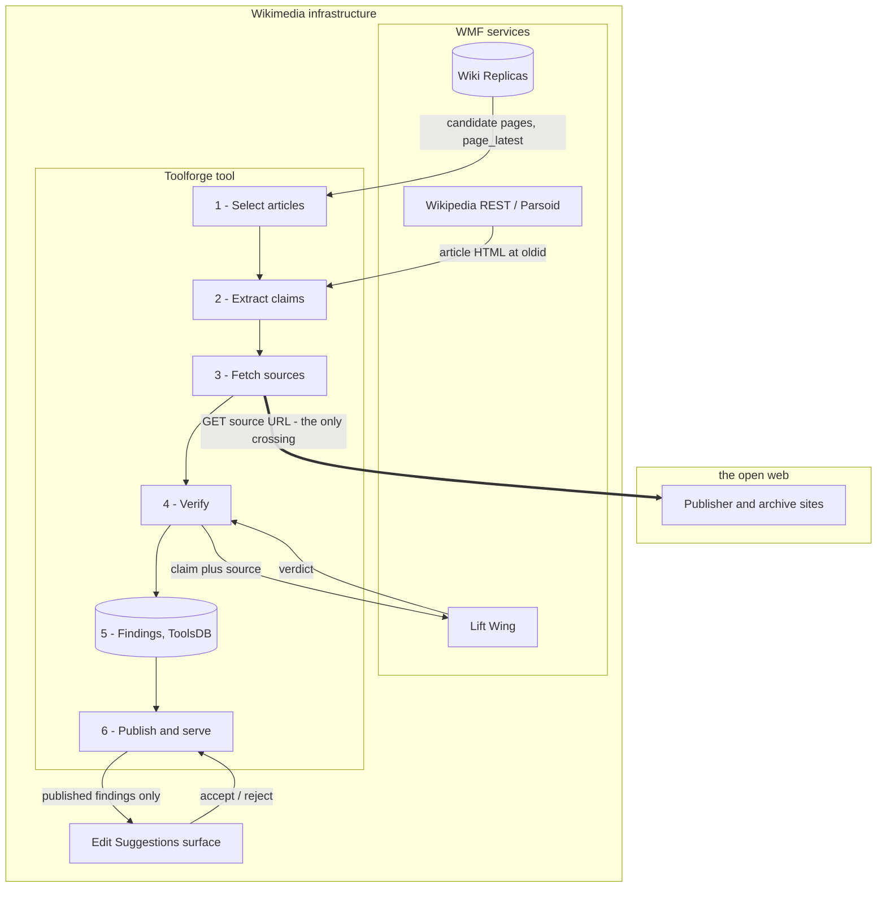
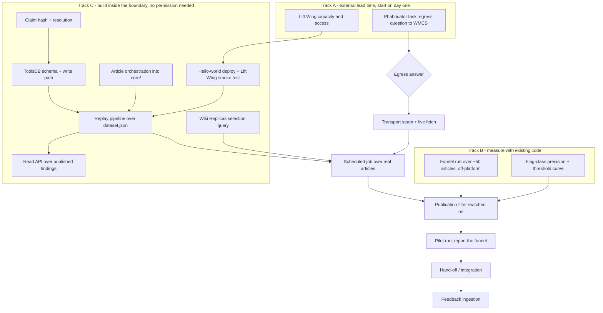

# Batch source checks as an Edit Suggestions feed

> **Status (2026-08-07):** Proposed. Requirements analysis for the WMF Edit Suggestions integration — no implementation started. Revised same day after the maintainer settled the precision approach (§1) and the Foundation suggested Toolforge for hosting (§5).

## The use case

The Wikimedia Foundation wants sourcing problems to appear as **edit
suggestions**: an editor opens an article and sees "this claim may not be
supported by its citation" alongside the other suggested-edit types.

That inverts how this tool works today. The current shape is:

```
editor clicks [14] → fetch source → one LLM call → verdict in the sidebar
```

The proposed shape is:

```
scheduled job picks N articles → fetch every source → LLM per citation → findings DB
                                                                             ↓
                                   editor opens article → API reads DB → suggestion cards
```

Three properties change, and nearly every requirement below falls out of one of
them:

| | Today | Batch + API |
| --- | --- | --- |
| **Who is present** | The editor, watching a progress bar, with the article in front of them | Nobody. Results are written hours or days before anyone reads them |
| **Cost of a wrong answer** | Editor reads the rationale, disagrees, closes the panel | A suggestion is pushed at an editor who did not ask for it |
| **What identifies a finding** | The `[14]` on screen, right now | A row in a database that must still point at the right claim after the article has been edited |

## Architecture at a glance

Almost every component sits inside Wikimedia infrastructure — the article text,
the article selection, the model, the database, the reader. Exactly one edge
leaves it, and that edge is the prerequisite in §5.



| Stage | Does | Reuses |
| --- | --- | --- |
| 1 Select | Wiki Replicas query for pages carrying `{{Failed verification}}` / `{{Citation needed}}`; writes a priority queue | — (new) |
| 2 Extract | Parsoid HTML at a pinned `oldid` → claim per citation, adjacent-group detection | `core/claim.js`, `core/urls.js` |
| 3 Fetch | Cited URL → readable text, Wayback fallback, content-addressed cache | `core/worker.js` (needs a transport seam, §5) |
| 4 Verify | One model call per claim → verdict, confidence, rationale | `core/prompts.js`, `core/providers.js`, `core/parsing.js` |
| 5 Store | Row keyed on a claim-text hash, not the citation number (§2) | — (new) |
| 6 Serve | Narrow publication filter (§1) + read-time claim re-resolution (§3) | — (new) |

The live userscript path is unchanged and runs in parallel: browser → Cloudflare
Worker → source and LLM. Both paths consume the same `core/` modules, the
userscript via `scripts/sync-main.js` inlining and the batch runner by importing
them directly.

## 1. Precision: publish conservatively, measure the threshold

**Decision (maintainer):** ship a deliberately narrow filter rather than
treating overall accuracy as a gate. Publish only high-confidence
NOT SUPPORTED findings — `reason_type: "contradiction"` first — and accept low
coverage as the price. This is the right call: there is no shortage of
citations to check, so recall costs nothing but throughput, and precision is
the only number an editor experiences.

The benchmark numbers below are therefore **not a blocker** — they are the
input for choosing where to put the threshold. Computed from
`benchmark/analysis.json` (186 entries, latest run); "flag" = NOT SUPPORTED or
PARTIALLY SUPPORTED, i.e. anything that would generate a suggestion:

| Provider | Exact acc. | NOT SUPPORTED precision | NOT SUPPORTED recall | Any-flag precision |
| --- | --- | --- | --- | --- |
| Gemini 2.5 Flash | 66.7% | 71% | 83% | 77% |
| Qwen SEA-LION | 60.0% | 72% | 57% | 84% |
| Apertus 70B | 54.2% | 50% | 39% | 64% |
| Claude Sonnet 4.5 | 48.9% | 50% | 15% | 81% |

What the conservative-start decision still requires:

1. **Report precision on the flag class.** `analyze_results.js` currently
   reports exact accuracy across four classes, which is a different target.
   Add flag-class precision/recall and a precision-vs-confidence-threshold
   curve — that curve is what the threshold gets read off.
2. **Validate that confidence discriminates.** The gate assumes high confidence
   means more reliable. Today's calibration is weak (Apertus averages 79 when
   correct, 74 when wrong), so the threshold may need to be very high, or
   confidence may need to be replaced by an ensemble gate as the filter.
   `benchmark/voting.js` and `compute_ensemble.js` already exist, and 2×
   inference cost is affordable in batch in a way it is not in the live path.
3. **Split `reason_type` in the metrics.** The plan leans on contradictions
   being more reliable than omissions. Plausible — a contradiction is grounded
   in a quoted passage, an omission is an absence-of-evidence claim that a
   truncated source produces spuriously — but it is currently an untested
   assumption, and `reason_type` is already stored per result, so it is a cheap
   thing to confirm.
4. **Keep PARTIALLY SUPPORTED out of v1.** Most-confused class, hardest to act
   on, and often an artifact of between-citations claim extraction splitting a
   compound sentence rather than a real sourcing defect.
5. **Never publish SOURCE UNAVAILABLE.** It describes the crawler's luck, not
   the article. Store it (§7 — it is operationally valuable) and filter it at
   the API.

## 2. A finding needs a stable anchor

Today a result is identified by the rendered citation number, `[14]`. That
number is a **rendering artifact of one revision**: insert a citation into the
lead and every number below it shifts. Batch results written on Tuesday and
read on Friday would point at the wrong claim.

Nothing in the current data model survives an edit. `verification_logs` stores
`article_url` + `citation_number` (`docs/worker-logging-reference.md`); the
report path stores `refElement` DOM handles plus `reportRevisionId`
(`main.js`). Both are revision-scoped by construction.

A stored finding needs to identify, in this order of preference:

- **The claim** — a normalized hash of the extracted claim text is the most
  robust available anchor, because `extractClaimText()` already normalizes
  whitespace and strips maintenance markers. It survives citation renumbering,
  paragraph reordering, and section moves. It does not survive a copyedit of
  the claim itself, which is the correct behavior: if the claim changed, the
  verdict is void.
- **The citation** — the source URL, plus the `<ref name="...">` when present.
  Together with the claim hash this is close to unique.
- **The revision it was computed against** — `oldid`, non-negotiable, so the
  reader can tell how stale the finding is and diff against current.

And the API needs a resolution step at read time: given a finding and the
*current* article, locate the claim; if it can't be located, drop the
suggestion silently. Failing to match is the normal case for a stale finding,
not an error.

**Wikitext vs HTML is a real gap.** Everything in `core/` operates on rendered
HTML — `getCitationGroup` walks `.reference` elements, `extractClaimText` uses
DOM Ranges. Edit suggestions are consumed in an editor working on **wikitext**
(or on the VE DOM). Whoever builds the suggestion card has to map HTML-derived
claim text back to a wikitext offset. Parsoid HTML carries `data-mw` and
`about`/`id` attributes that make this tractable — worth pinning down early
with the Suggestions team, because if the mapping has to happen on our side it
is a substantial new component, and if it happens on theirs we only have to
hand over clean claim text.

## 3. Staleness and invalidation

Once results outlive the page view, the pipeline owns a cache-invalidation
problem it does not have today:

- **Article edited** → every finding on that revision is suspect. On Toolforge
  this is cheap: Wiki Replicas expose `page.page_latest`, so a single indexed
  query tells the job which of its findings were computed against a superseded
  revision. No EventStreams consumer needed for v1.
- **Claim fixed by an editor** → must stop being suggested immediately, and the
  fix is exactly the outcome the feature exists to produce. Claim-hash
  resolution handles this for free: the editor rewrites the claim, the hash
  stops matching, the suggestion disappears.
- **Source changed underneath a live URL** → invisible to us. A TTL is the only
  practical answer — a per-finding `expires_at` rather than a constant baked
  into queries.
- **Citation removed or replaced** → resolution fails, finding drops.

## 4. What has to be built (and what already exists)

The 2026 `core/` extraction did most of the hard work. `core/` is pure ESM with
no browser assumptions, and `cli/verify.js` is a working headless end-to-end
path: Wikipedia REST fetch → JSDOM → claim extraction → source fetch → LLM →
parsed verdict, with typed exit codes.

**Reusable unchanged:** `core/claim.js`, `core/urls.js`, `core/parsing.js`,
`core/prompts.js`, `core/providers.js`, `core/verdicts.js`, `core/retry.js`.

**What's missing:**

| Piece | Notes |
| --- | --- |
| **Article-level headless runner** | `cli/verify.js` does one citation; `verifyAllCitations()` does a whole article but is ~250 lines welded to the sidebar DOM, OOUI confirm dialogs, progress bars, and `mw.config`. The orchestration (source cache, collective group pass, retry, cancellation) is worth extracting to `core/` and sharing, rather than writing a third copy |
| **Swappable fetch transport** | `core/worker.js` hardcodes the Cloudflare proxy. Server-side there is no CORS problem, so the batch path should fetch directly (§5) behind the same `{ content, error, status }` contract |
| **Work queue** | Which articles, in what order. Does not exist in any form |
| **Findings store** | `verification_logs` is a fire-and-forget telemetry log with no idempotency key, no revision, no claim text, no rationale. A findings table is a new schema, not an extension of that one (§6) |
| **Read API** | New. Auth, per-article and per-wiki queries, filtering |
| **Feedback ingestion** | Accept/reject signal from editors flowing back (§9) |
| **Cost accounting** | `usage` is returned per call by every provider in `core/providers.js` and thrown away outside the benchmark |

One structural note: `main.js` is built by inlining `core/` via
`scripts/sync-main.js`. A batch service should import `core/` directly, the way
`benchmark/` and `cli/` do — resist any temptation to fork logic into the
service.

## 5. Hosting on Toolforge

The Foundation suggested [Toolforge](https://wikitech.wikimedia.org/wiki/Help:Toolforge),
and it is a good fit for most of this. It also resolves the ownership problem
the current architecture has, where inference and fetching run through one
personal Cloudflare Worker on one person's API credits.

### What Toolforge supplies that we would otherwise build

| Need | Toolforge answer |
| --- | --- |
| Scheduler (§4) | [Jobs framework](https://wikitech.wikimedia.org/wiki/Help:Toolforge/Running_jobs) — `toolforge jobs run --schedule '<cron>'` for the batch sweep, `--continuous` for a queue-draining worker (auto-restarted on failure) |
| Findings store (§6) | [ToolsDB](https://wikitech.wikimedia.org/wiki/Help:Toolforge/ToolsDB) — shared MariaDB at `tools.db.svc.wikimedia.cloud`, databases named `<credentialUser>__<name>` |
| Article selection (§8) | [Wiki Replicas](https://wikitech.wikimedia.org/wiki/Help:Toolforge/Database) — query `templatelinks` / `categorylinks` for `{{Failed verification}}`, `{{Citation needed}}` etc. directly, instead of crawling to find candidates |
| Staleness detection (§3) | Wiki Replicas `page.page_latest` |
| Read API (§4) | Toolforge web service, Node.js supported via the build service |
| Secrets | [Envvars](https://wikitech.wikimedia.org/wiki/Help:Toolforge/Envvars) for any provider API key |
| Deploy | Buildpack build from the git repo; the repo is already Node ESM with `engines: >=18` |
| Licensing | Toolforge requires an OSI-approved license. The repo is MIT — already compliant |
| Bulk corpus | [Shared storage](https://wikitech.wikimedia.org/wiki/Help:Shared_storage) at `/public/dumps` (XML/wikitext dumps, pagecounts, Wikidata JSON) |

Two of these are more than conveniences. **Wiki Replicas collapses §8 from "a
component to design" into "a SQL query"** — and gives the maintenance-template
signal that `MAINTENANCE_MARKER_RE` in `core/claim.js` already knows how to
recognize. And **the jobs framework means there is no scheduler to write**,
only a queue table and a job that drains it.

### What changes in the design

**The Cloudflare Worker stops being on the batch path.** Its main job is CORS,
which only exists because `main.js` runs on `en.wikipedia.org`. A Toolforge job
fetches sources directly. Three consequences, all good:

- The **413 body cap disappears** — that was the proxy's request-size limit, not
  a model limit, and `core/providers.js` currently handles it by telling the
  *user* to trim the source. There is no user in batch; removing the cap removes
  the need for a chunking fallback in v1.
- Fetch behavior becomes ours to control (User-Agent, per-host backoff,
  `robots.txt`), rather than the worker's.
- `core/worker.js` needs a transport seam so the userscript keeps the proxy and
  the batch path fetches directly. Same `{ content, error, status }` contract,
  two implementations.

The worker is still needed **for the userscript**. Worth considering as a
follow-up: a Toolforge web service could take over that role too, retiring the
personal Cloudflare account entirely and putting the CORS proxy, the batch job,
and the findings API in one WMF-hosted, open-source tool.

**Lift Wing becomes the obvious inference backend.** `callLiftwingAPI` already
exists in `core/providers.js`. WMF-hosted inference from WMF-hosted compute
means no API key in envvars, no billing, no per-call cost accounting, and no
question about a Wikimedia tool sending content to a commercial vendor. It also
removes the failure mode that voided 17% of the last benchmark run: 31 of 186
calls failed on *both* PublicAI models with `HTTP 402: Insufficient wallet
balance` — credits ran out partway through and every subsequent call failed
identically, unannounced. (If a commercial provider is used anyway, the runner
must **halt** on 401/402 rather than burn through the queue writing failures.
`core/retry.js` correctly doesn't retry those, but nothing currently stops the
loop.)

Caveat worth checking: the worker clamps Lift Wing `max_tokens` to 4096 and
strips `<think>` blocks from reasoning models. Calling Lift Wing directly means
reimplementing the strip, or the verdict parser sees reasoning text.

### Constraints that bite

- **2 vCPU / 8 GB, ~4 GB per job.** Fine — this workload is I/O-bound (HTTP
  fetches and API calls), not compute. JSDOM on a large article is the main
  memory consumer and is comfortably inside 4 GB for one article at a time.
- **No GPU, and only platform-provided or buildpack-installed packages.** This
  rules out running models on-platform. The MiniCheck evaluation floated in
  `docs/researcher-feedback-review.md` cannot run here; inference is Lift Wing
  or an external API, full stop.
- **500 simultaneous connections per wiki, and a tool using >50 may be stopped
  without warning.** Keep API concurrency low (single digits) and prefer
  Replicas and dumps for anything bulk. This is not a constraint the current
  benchmark runner respects — `--concurrency` is per-host with no wiki-specific
  ceiling.
- **Best-effort platform.** Wiki Replica lag is explicitly best-effort and has
  historically run 24h+ behind during incidents. Fine for a batch producer;
  a risk if a production MediaWiki surface reads our API synchronously (see the
  open question below).

### The open question that has to be settled first

**Is it acceptable to fetch arbitrary third-party publisher URLs from
Toolforge?** This is the tool's core operation and it is not a typical
Toolforge workload. The documentation does not address outbound crawling of
external sites; [Wikimedia network guidelines](https://wikitech.wikimedia.org/wiki/Wikimedia_network_guidelines)
say hosts needing outbound web access should use HTTP proxies where possible,
and the [Toolforge rules](https://wikitech.wikimedia.org/wiki/Help:Toolforge/Rules)
are about benefit-to-the-movement rather than egress.

Concentrating what is currently thousands of editors' individual fetches onto
Wikimedia IP space, unattended and at volume, is a reputational exposure for
WMF (publishers blocking Wikimedia ranges) as much as a technical one. It needs
clearing with WMCS admins on `cloud@` or Phabricator **before** any of this is
built, because a "no" changes the architecture completely — the fetch tier
would have to stay off-platform, and the current Cloudflare worker becomes a
permanent component rather than a legacy one.

Whatever the answer, the fetcher needs a descriptive User-Agent with a contact
URL, per-host rate limiting and backoff, and `robots.txt` respect. And it must
distinguish "dead link" from "we were refused" — today a 403 and a 404 both
surface as SOURCE UNAVAILABLE, so a publisher block would silently corrupt the
findings rather than announce itself. `fetchSourceContent()` already returns
`status`; the consumer has to treat 403/429 as *retry later*, never as a
finding.

## 6. Storage

ToolsDB is **MariaDB**, so the schema below is MySQL-dialect rather than the
Postgres the existing `verification_logs` table uses. Databases ending in `_p`
are world-readable and reachable from Quarry and Superset — worth taking, both
because publishing the findings fits movement norms and because it lets others
audit and build on the data without asking us for access.

```sql
CREATE TABLE citation_findings (
  id               BIGINT AUTO_INCREMENT PRIMARY KEY,
  wiki             VARBINARY(32)  NOT NULL,  -- 'enwiki' — per-wiki from day one
  page_id          INT UNSIGNED   NOT NULL,  -- stable across renames, unlike the title
  page_title       VARBINARY(255) NOT NULL,  -- denormalized for display
  revision_id      BIGINT UNSIGNED NOT NULL, -- the oldid this was computed against
  claim_hash       BINARY(32)     NOT NULL,  -- normalized claim text hash — the anchor (§2)
  claim_text       TEXT           NOT NULL,  -- for display and re-resolution
  citation_number  INT,                      -- display only; NOT an identifier
  ref_name         VARBINARY(255),           -- <ref name="..."> when present
  source_url       TEXT,
  source_hash      BINARY(32),               -- content hash of the fetched text
  group_id         VARBINARY(64),            -- adjacent-citation group (core/claim.js)
  is_collective    TINYINT(1)     NOT NULL DEFAULT 0,
  verdict          VARBINARY(32)  NOT NULL,
  confidence       TINYINT UNSIGNED,
  reason_type      VARBINARY(16),            -- 'contradiction' | 'omission'
  rationale        TEXT,                     -- the model's comments — editors need the why
  provider         VARBINARY(32),
  model            VARBINARY(128),
  prompt_version   VARBINARY(32)  NOT NULL,  -- invalidate findings when prompts change
  fetch_status     SMALLINT,                 -- upstream HTTP status
  source_truncated TINYINT(1)     NOT NULL DEFAULT 0,
  tokens_in        INT,
  tokens_out       INT,
  created_at       TIMESTAMP      NOT NULL DEFAULT CURRENT_TIMESTAMP,
  expires_at       TIMESTAMP      NULL,
  published        TINYINT(1)     NOT NULL DEFAULT 0,  -- passed the §1 filter
  UNIQUE KEY uniq_finding (wiki, page_id, claim_hash, source_hash, provider, prompt_version),
  KEY idx_lookup (wiki, page_id, published),
  KEY idx_expiry (expires_at)
);
```

Three columns carry more weight than they look like they do:

- **`prompt_version`** — the system prompt's 9 few-shot examples are load-bearing
  (CLAUDE.md says so explicitly), and changing them changes verdicts. Without a
  version column there is no way to answer "which findings came from the prompt
  we no longer trust", and no way to invalidate them.
- **`published`** — separates *what we computed* from *what we show*. The §1
  filter is a predicate on this column, which means the threshold can be
  re-tuned without re-running any inference.
- **`rationale`** — a suggestion that says "this citation may not support the
  claim" with no reasoning is unactionable, and the model's quoted-evidence
  comment is the most useful thing it produces.

Note `source_hash` rather than `source_url` in the unique key: the same source
reached via a live URL and via a Wayback snapshot should not produce two
findings. `core/worker.js` already falls back to Wayback transparently.

Adjacent-citation groups are handled by
`docs/design-plans/2026-06-23-collective-group-verification.md`: for a group,
the **collective** verdict is the one to publish, not the per-source verdicts —
that design exists precisely because per-source verdicts on grouped citations
mislead. `getReportUnits()` in `main.js` implements the merge and is the
reference for the semantics.

## 7. Coverage

Not every citation is checkable, and the pipeline should be explicit about its
denominator rather than treating "unchecked" as "fine":

- **Google Books URLs are skipped outright** (`isGoogleBooksUrl`, `core/urls.js`).
- **Offline sources** — books, journals, newspapers — have no URL. In the live
  tool the editor can upload a PDF or paste text (`handlePdfFileSelected`,
  `loadManualSourceText`). There is no batch equivalent and no way to invent one.
- **Paywalls, bot-blocks, and JS-rendered pages** fetch "successfully" and
  return login walls or empty shells.

Combined with the conservative §1 filter, published findings will be a small
fraction of citations examined. That is the intended trade, but the Foundation
should hear the number up front rather than discover it later — so the first
pilot run should report the funnel explicitly: citations seen → had a URL →
fetched → verified → flagged → published.

## 8. Article selection

With Wiki Replicas this is a query rather than a component. Roughly in
increasing order of sophistication:

- Pages transcluding `{{Failed verification}}` / `{{Citation needed}}` — highest
  prior, and a built-in ground-truth signal, since `MAINTENANCE_MARKER_RE` in
  `core/claim.js` already detects those markers in the extracted claim.
- High-traffic articles (pageviews come from the Analytics API, not Replicas),
  where a fixed error rate does the most damage.
- WikiProject or campaign scope, if the Suggestions surface is organized that
  way.
- Recently-edited articles, where a new unsourced claim is freshest.

The cheapest useful first version is a queue table with a priority column, fed
by the first of these.

## 9. The feedback loop is the real prize

If a suggestion card carries accept/reject, every interaction becomes a labeled
example — exactly the data `Benchmarking_data_Citations.csv` is painstakingly
hand-built from today (189 rows, with a documented history of ground-truth
audits). At Foundation scale this would produce more labeled data in a week
than the project has accumulated in a year.

That argues for designing feedback capture **into the first version**. The
`submission.js` Google-Form path is fine for volunteers; a Foundation
integration should write straight to the store.

One caution: this feedback is not the same as ground truth. Editors reject
suggestions for reasons unrelated to correctness (already fixed, not worth it,
disagree with the underlying tag). Reject-rate is a usefulness metric; treat it
as a proxy for precision only after auditing a sample.

## 10. Governance

- **Per-wiki scope.** The prompt is English and its few-shot examples are tuned
  on English Wikipedia. The UI is localized (fr/es) but the prompts deliberately
  are not — `localizeSystemPrompt()` only asks for output in another language.
  Extending to other wikis means new benchmark data per wiki, not translation.
- **Attribution and transparency.** Editors should see which model produced a
  suggestion and when. The schema supports it; the card should surface it.
- **Opt-out.** Some projects will want none of this.
- **No automated edits.** Suggestions only, stated somewhere durable.
- **Toolforge terms.** Code must benefit the movement and be openly licensed —
  both already true.

## Build sequence

The ordering principle: **only stage 3 needs anyone's permission.** Selection,
extraction, verification, storage and serving all sit inside Wikimedia
infrastructure (Figure: Architecture at a glance), so the entire pipeline
minus the source fetch can be built and demonstrated before WMCS answers
anything.

Two things make that practical:

- A **Toolforge account already exists**, so the week-long membership approval
  is not on the path. (Creating the per-tool *tool account* on toolsadmin is
  self-serve and quick if it isn't there yet.)
- `benchmark/dataset.json` carries **stored `source_text` for 182 of its 189
  entries**, median ~7 KB, all of it really fetched from real citations. That is
  a replay corpus: stages 4–6 can run against it end to end with zero outbound
  requests.

So the sequence front-loads a working vertical slice and leaves the open-web
fetch as the last thing wired in.



### Track A — external lead time (day one, not engineering)

Latency, not effort. Both should be in flight before any code is written.

1. **The egress question to WMCS** (§5). A Phabricator task under
   Cloud-Services, with the traffic shape and the mitigations already named.
   Worth doing first: from an interactive Toolforge shell, check whether
   outbound HTTPS to an arbitrary host works at all, and what the egress path
   looks like. A handful of manual requests while exploring the platform is
   ordinary development, categorically unlike an unattended crawler — and it
   turns the ask from "is this possible?" into the narrower and more answerable
   "it works technically; is it acceptable at this volume, with these
   mitigations?"
2. **Lift Wing access and capacity.** Determines whether there is a billing
   conversation at all. Also testable early: a smoke call from Toolforge is
   entirely inside WMF infrastructure and answers part of open question 2
   before the meeting.

### Track B — measure before committing (existing code, ~days)

The two genuine unknowns are measurement questions, not engineering ones, and
both can be answered with what is already in the repo.

4. **Flag-class precision, threshold curve, `reason_type` breakdown** in
   `analyze_results.js`. Pure analysis over the `results.json` that already
   exists — no new inference, no new data. Output: the §1 threshold, or the
   discovery that confidence doesn't discriminate and the filter has to be an
   ensemble instead.
5. **The funnel, over ~50 real articles.** This one cannot come from the
   benchmark: `dataset.json` is pre-filtered to citations whose sources were
   fetchable, which is exactly the number we need to measure. So it needs a
   throwaway script over `cli/verify.js`'s machinery, counting citations seen →
   had a URL → fetched → verified → flagged → published.

   At 50 articles from a laptop this is indistinguishable from an editor using
   the tool, so it needs no permission and does not wait on Track A. And it is
   deliberately a throwaway rather than waiting for step 6 to build it properly
   — the go/no-go answer should not be gated on refactoring the most-used code
   path in the shipped userscript.

### Track C — build the pipeline inside the boundary (no permission needed)

Everything here runs entirely within Wikimedia infrastructure. None of it waits
on Track A, and steps 6–8 improve the existing userscript and CLI regardless of
what the Foundation decides.

6. **Hello-world deploy, plus a Lift Wing smoke call.** Half a day. Shakes out
   buildpack, Node version, and envvar surprises, and confirms the inference
   path, before anything depends on either.
7. **Extract the article-level orchestration** out of `verifyAllCitations()`
   into `core/` — source cache, collective group pass, retry loop, progress
   callbacks — leaving `main.js` as a thin UI adapter. This touches the
   userscript's most-used path, so it should be a pure refactor with no
   behavior change, verified by running the benchmark before and after:
   `ccs compare` with `--change-axis` exists precisely to prove a change didn't
   move verdicts.
8. **Claim hashing and resolution** in `core/claim.js` (§2): normalize, hash,
   and the routine that locates a stored claim in a current article or fails
   cleanly. Pure logic, testable offline, and the thing the schema depends on —
   which is why it comes before any table is created.
9. **ToolsDB schema and write path** (§6) — informed by step 8's anchor format
   and step 4's filter fields.
10. **Wiki Replicas selection query** (§8) — pages carrying maintenance
    templates, into a priority queue table. Pure SQL against a replica that is
    already accessible; nothing here touches the open web.
11. **Replay the pipeline over `dataset.json`.** Feed the stored `source_text`
    into stages 4–6 on Toolforge: verify, store against a claim hash, apply the
    publication filter, expose the result. Zero outbound requests, real claims,
    real sources, real verdicts.

    This is the highest-value step in the whole sequence and it is available
    immediately. It produces a **working system to demonstrate**, which is a
    categorically better thing to bring to the Foundation than a design
    document — and it de-risks every integration point except the one under
    discussion.
12. **Read API over published findings**, with read-time claim re-resolution.
    Buildable and testable against the replayed corpus. Whether the *hand-off*
    is this API or a periodic export depends on open question 4; the query layer
    is the same either way, so only the last hop waits.

### The gate — and what it actually gates

Only **stage 3, at volume**. When WMCS answers:

13. **Transport seam in `core/worker.js`** — proxy transport for the browser,
    direct transport for Node, one `{ content, error, status }` contract — plus
    `ccs verify-article <url>` on top of it. If the answer was no, this is where
    the fetch tier stays off-platform instead, and the rest of the pipeline is
    untouched.
14. **Scheduled job over real articles**, wrapping step 7's runner, halting on
    auth/billing errors rather than draining the queue into failures.
15. **Switch on the publication filter** at the threshold step 4 produced.
16. **Pilot run.** Report the §7 funnel from real infrastructure — measured
    rather than estimated, which is the number the Foundation will want.
17. **Feedback ingestion** (§9), gated on whether the card exposes accept/reject
    at all.

### Deliberately not early

- **The schema**, before step 9 fixes the anchor format.
- **Wikitext offset mapping**, before open question 3 is answered — it is either
  unnecessary or a substantial component, and we don't yet know which.
- **Chunking oversized sources.** That was a limitation of the proxy's request
  cap, and it disappears when the batch path fetches directly (§5).
- **Multi-wiki anything.** The prompt's worked examples are tuned on English
  Wikipedia; a second wiki needs its own benchmark data, not a translation.
- **Feedback ingestion**, before knowing the card exposes it.

### The critical path

Track A → steps 13–16. Everything else is off it.

The account already existing collapses what used to be the first week of
waiting, and the replay corpus removes the fetch from the dependency chain
entirely — so the pipeline can be standing up while WMCS deliberates. If the
egress answer takes three weeks, those three weeks produce a demonstrable
system; if it comes back no, only steps 13–14 change shape and nothing built
is wasted.

## Open questions for the Foundation

1. **Is unattended crawling of third-party publisher URLs from Toolforge
   acceptable to WMCS?** (§5 — blocking.)
2. Can Lift Wing serve this volume, and which models? It removes the billing
   and vendor questions entirely if so.
3. Does the Suggestions surface resolve claim text to a wikitext location, or
   must we hand over a wikitext offset? (§2.)
4. Toolforge is best-effort with no SLA. Can a production Edit Suggestions
   surface read from a Toolforge API, or does the data need to be exported into
   a production store — and if so, who owns that hop?
5. What precision bar does the Suggestions queue hold other suggestion types to?
6. Which wikis, and what article volume? This sets the throughput target.
7. Does the card surface accept/reject, and can that signal come back to us?
