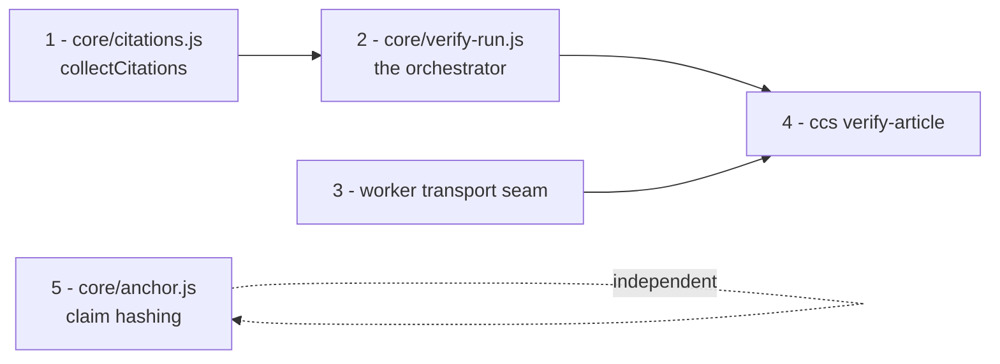

# Track C: extracting the verification orchestration into `core/`

> **Status (2026-08-10):** Proposed. Implementation plan for Track C of `2026-08-07-batch-source-checks-for-edit-suggestions.md`. Split across five branches; nothing implemented yet.

## Goal

`verifyAllCitations()` in `main.js` already does everything the batch pipeline
needs — iterate citations, cache sources, retry transient failures, run the
collective pass for adjacent groups, accumulate token usage. It just does it
welded to OOUI dialogs, a progress bar, `mw.config`, and `this.t()`.

Extract the orchestration so the userscript, the CLI, and the Toolforge batch
job are three thin adapters over one implementation — the same relationship
`benchmark/` and `cli/` already have with `core/`.

**Non-goals for this track.** No behavior change in the userscript. No live
fetching from Toolforge (that is behind the egress gate). No direct-fetch
transport implementation — only the seam it will plug into.

## Why now, beyond the batch pipeline

`main.js` is a 5,600-line IIFE that cannot be imported, so anything inside it
can only be tested by extracting source text at runtime.
`tests/report_filters.test.js` genuinely does this:

```js
const start = src.indexOf('        applyReportFilters() {');
const end = src.indexOf('        renderReportSummary() {');
const method = src.slice(start, end);
```

It string-slices a method out of the file by index and evals it. That test
breaks if anyone renames a neighbouring method. Every piece moved into `core/`
becomes an ordinary ESM import with ordinary tests — so the extraction pays for
itself in test quality independently of whether the Foundation integration
happens.

## The seam

Reading `verifyAllCitations()` and `verifyGroupCollective()`, the code sorts
into three piles.

**Pure orchestration — moves to `core/`:**
the citation loop; the source cache keyed `url|page=N`; the retry-wrapped
provider call; result-object construction; the group-close detection
(`groupIndex === groupSize - 1`) and the collective pass; dedupe of sources
shared by named refs; rate-limit delays; token accumulation; `getReportUnits()`.

**UI and browser — stays in `main.js`:**
the `OO.ui.confirm` estimate dialog; `showReportView`, `renderReportCard`,
`renderReportSummary`, `applyReportFilters`, `renderReportActions`,
`updateButtonVisibility`; `updateReportProgress` and its ETA; `this.t()`;
`mw.config.get('wgCurRevisionId')`; the Cancel button.

**Ambiguous — three decisions below.**

### Decision 1: reason codes, not localized prose

Today a result can carry `comments: this.t('No URL found in reference')` — a
translated user-facing sentence sitting in the data model. That is already
awkward, and it becomes wrong once results are rows in a database: the DB would
store French prose depending on who ran the job.

Core emits a machine code; the presenter localizes:

```js
{ verdict: 'SOURCE UNAVAILABLE', unavailableReason: 'no_url', fetchStatus: null }
{ verdict: 'SOURCE UNAVAILABLE', unavailableReason: 'fetch_failed', fetchStatus: 403, fetchError: '...' }
```

`main.js` maps `unavailableReason` → `this.t(...)` at render time. The model's
own `comments` (real prose from the LLM) passes through untouched — that stays
in whatever language the prompt asked for, which is correct and is what gets
stored.

### Decision 2: `ref` is opaque

Results currently carry `refElement`, a live DOM node, used for scroll-to-citation
and highlighting. Node has JSDOM nodes, which are useless to persist.

Core treats the field as an **opaque passthrough**: it copies `citation.ref` onto
the result and never inspects it. The browser puts a DOM element there; the batch
job puts `null` or a Parsoid `about` id; the persistence layer ignores it. No
`instanceof` checks, no DOM API calls on it inside `core/`.

### Decision 3: `AbortSignal` for cancellation

`this.reportCancelled` is checked in seven places, including inside the retry
helper's `shouldAbort`. An `AbortSignal` is the standard equivalent, works
identically in browser and Node, and `core/retry.js` already has the
`shouldAbort` hook to wire it into.

The Cancel button calls `controller.abort()`; the generator's `finally` runs;
`main.js` renders the "Cancelled after N of M" state exactly as now.

## Shape: an async generator

The consumers need incremental output — the sidebar renders each card as it
lands, and the batch job should write each finding rather than buffer an
article. Three options:

| | |
| --- | --- |
| Callback options bag (`onResult`, `onProgress`, …) | Works, but five callbacks is a worse API than one loop, and ordering between them is implicit |
| Return all results at the end | Loses incremental rendering — a visible regression |
| **Async generator yielding events** | One consumption pattern, natural cancellation via `break`, and tests just collect the yielded array |

Async generator wins, and it makes the tests trivial: drive it with a fake
provider and a fake fetcher, collect events into an array, assert on the
sequence.

```js
// core/verify-run.js
export async function* runVerification(citations, {
  fetchSource,     // (url, pageNum) => Promise<{ content, error, status }>
  verifySingle,    // (claim, sourceInfo)   => Promise<{ text, usage }>
  verifyGroup,     // (claim, assembledText) => Promise<{ text, usage }>
  cache = new Map(),          // injectable so batch can share across articles
  delayBetweenCalls = 1000,
  signal,                     // AbortSignal
  retry = { maxRetries: 4, minBackoffMs: 5000, maxBackoffMs: 30000, jitterMs: 0 },
  sleep = ms => new Promise(r => setTimeout(r, ms)),  // injectable: tests run instantly
}) { /* … */ }
```

Core knows nothing about providers, API keys, prompts, or localization — the
caller injects `verifySingle` / `verifyGroup` with prompts already bound. That
keeps provider routing and the `localizeSystemPrompt()` wrinkle out of the
orchestrator entirely.

To stop the two callers hand-rolling the same binding, `core/` also offers the
default builder, which `runVerification` never depends on:

```js
export function makeVerifiers({ provider, apiKey, model, systemPromptTransform });
```

### Event vocabulary

```js
{ type: 'progress', phase: 'fetching'|'verifying'|'retrying'|'group', citationNumber, completed, total, retryInMs? }
{ type: 'result',        result }        // per-source
{ type: 'group-result',  result }        // collective verdict for an adjacent group
{ type: 'group-skipped', groupId }       // ≤1 source available; members stand alone
{ type: 'done', completed, total, aborted }
```

`phase` is a code, not a sentence — `main.js` maps it to the localized progress
strings it already has. Token usage rides on each result's `usage` rather than a
separate event, so a consumer that drops events can still account correctly.

`providerName` / `model` are **not** stamped by core; the caller knows them and
attaches them, keeping provider identity out of the orchestrator.

## Module layout

```
core/
  citations.js    NEW  collectCitations(root) + group metadata
  verify-run.js   NEW  runVerification() generator, makeVerifiers(), getReportUnits()
  anchor.js       NEW  normalizeClaim(), claimHash(), resolveClaim()
  worker.js       MOD  transport seam
  claim.js        —    unchanged
  prompts.js      —    unchanged
  providers.js    —    unchanged
  retry.js        —    unchanged
```

One wrinkle worth naming: `collectAllCitations()` scopes its query to
`#mw-content-text`, which exists in the MediaWiki skin but **not** in the REST
API's Parsoid output — `cli/verify.js` uses a bare `sup.reference` for exactly
this reason. So `collectCitations(root)` takes the root as a parameter: the
browser passes `document.querySelector('#mw-content-text')`, Node passes the
document.

### The transport seam

```js
// core/worker.js
export function proxyTransport({ workerBase });   // existing behaviour, extracted
export async function fetchSourceContent(url, pageNum, { transport });
```

The Google Books skip and the Wayback fallback stay in `fetchSourceContent` —
they are policy, shared by every transport. Only the actual retrieval moves
behind the seam.

**No `directTransport` in this track.** The proxy does HTML→text and PDF
extraction server-side, so a direct transport needs a readability-equivalent and
a PDF parser in Node — real work, and gated behind the egress answer anyway.
Track C ships the interface with one implementation; the replay pipeline needs
no transport at all.

## Validation

The refactor must not move a single verdict. Three layers:

1. **`npm test`** — new unit tests per module. `core/verify-run.js` gets a fake
   provider and fake fetcher; assert the event sequence for: solo citation,
   adjacent group, group with one unavailable source, group skipped at ≤1
   source, no-URL citation, retry-then-succeed, abort mid-run.
2. **`ccs compare`** — run the benchmark before and after and diff. This tool
   exists precisely to prove a change didn't move verdicts; use
   `--change-axis` and expect zero flips.
3. **Manual smoke** — a real "Verify all citations" run on an article with at
   least one adjacent group, checking the progress strings, the group block,
   the filter pills, and Cancel.

Rewriting `tests/report_filters.test.js` to import rather than string-slice is
**not** in scope here — `applyReportFilters` is UI and stays in `main.js`. Worth
a follow-up once more of the file is importable.

## Branch plan

Five branches. Three are small and independent; one is the risky one.



| # | Branch | Scope | Size | Risk |
| --- | --- | --- | --- | --- |
| 1 | `claude/core-citation-collection` | Move `collectAllCitations` + `attachGroupMetadata` → `core/citations.js` as `collectCitations(root)`. `main.js` delegates. Fixture-based tests. | Small | Low |
| 2 | `claude/core-verify-run` | `core/verify-run.js` generator; `verifyAllCitations` becomes a `for await` loop doing UI only; `verifyGroupCollective` folded in; reason codes; `getReportUnits()` moves. | Large | **High** |
| 3 | `claude/worker-transport-seam` | Transport parameter on `fetchSourceContent`, `proxyTransport` extracted, injectable fake for tests. | Small | Low |
| 4 | `claude/ccs-verify-article` | `ccs verify-article <url>` on top of 1–3. The batch engine. | Medium | Low |
| 5 | `claude/claim-anchoring` | `core/anchor.js`: normalize, hash, resolve-or-fail. Pure logic + tests. | Medium | Low |

**Branch 5 is independent of 1–4** and can be built in parallel — it touches no
existing code path. Good candidate to run alongside branch 2.

**Branch 2 is the one to be careful with.** It rewrites the userscript's
most-used path. If it feels too big in practice, the natural split is: first
extract a pure `verifyOneCitation(citation, deps)` covering fetch-cache →
retry → result construction for a single citation, land it with `main.js`'s loop
calling it unchanged; then replace the loop with the generator. Two smaller
diffs, each independently verifiable — at the cost of one throwaway intermediate
shape.

## Deliberately deferred

- `directTransport` — behind the egress gate, and needs Node-side text and PDF
  extraction.
- Rewriting `applyReportFilters`'s test harness — UI code, stays put for now.
- Wikitext offset mapping — depends on the Foundation's answer.
- Persistence and the ToolsDB schema — a later Track C step, and it wants
  branch 5's anchor format settled first.
