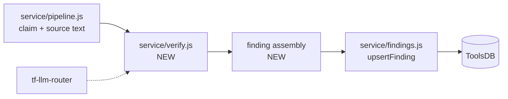
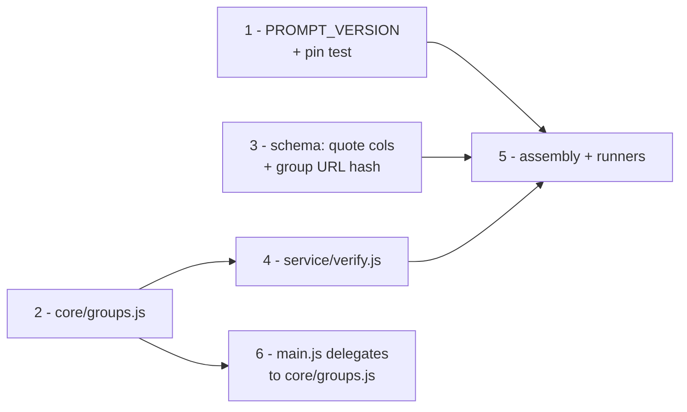

# Phase 4: closing the batch loop — verify, then persist

> **Status (2026-08-22):** In progress. Implementation plan for the verification
> and persistence stages of `2026-08-07-batch-source-checks-for-edit-suggestions.md`
> (stages 4 and 5), and the runner that joins them to the stages either side.
> Depends on nothing external — deliberately, this whole phase sits behind the
> WMCS egress gate rather than on it.
>
> **Landed same day:** branch 1 (`PROMPT_VERSION` + hash-pin test), branch 3's
> quote columns (`service/migrations/002-add-quote-columns.sql`, not yet
> applied to the live table — see that file's header), branch 4
> (`service/verify.js`), and branch 5 (`service/assemble.js`,
> `service/replay.js`, `service/toolsdb.js`, `service/wikipedia-pageids.js`).
> `npm test` covers all of it with fakes — no network, no bastion. **Not yet
> run against the real ToolsDB table or a real model**: that requires a
> provider API key (for `--dry-run`) and, for a real write, the Toolforge
> bastion (ToolsDB is unreachable from anywhere else) — neither was available
> in the session that wrote this code. See "Running the real integration
> test" below for the exact commands.
>
> **Not landed:** branch 2 (`core/groups.js`) and branch 6 (`main.js`
> delegating to it) — group/collective verification is out of scope for this
> first real run, since `benchmark/dataset.json` (the replay corpus) has no
> grouped citations to exercise it against (§3, "Wrinkle 2"). §6a's
> group/no-URL hash-collision fix is therefore also not yet needed and not
> yet built. `service/replay.js` resolves each dataset row's `page_id` via a
> live Wikipedia API call rather than a committed `benchmark/replay-page-ids.json`
> — simpler for a one-off real run than the byte-reproducible corpus §3
> originally proposed; revisit if this needs to become a repeatable CI-style
> replay rather than a manual integration test.

## Where the pipeline actually stands

Phases 1–3 built the two ends and left the middle empty. Every stage below is
real code in this repo or a deployed Toolforge tool; the gap is not a missing
feature, it is a missing *call*.

| Stage | State | Where |
| --- | --- | --- |
| 1 Select | Built | `service/selection.js`, `service/replicas.js`, `service/select-articles.js` |
| 2 Extract | Built | `service/pipeline.js`, `core/citations.js`, `core/claim.js` |
| 3 Fetch | Built, **opt-in only** | `tf-source-fetcher`, reached via `fetchSourceContent(url, n, { workerBase })`; stubbed by default pending WMCS |
| 4 **Verify** | **Absent from the batch path** | `tf-llm-router` is deployed, but `ccs verify --live-llm-router` is its only caller in this repo |
| 5 Store | Table + write path built, **no producer** | `service/findings.js`, `core/anchor.js`, ToolsDB `s57953__source_verifier.citation_findings` |
| 6 Serve | Not started | — |

`service/pipeline.js` stops, by its own header comment, at *"we have the claim
and we have the source text"*. `service/findings.js` starts at *"here is a
fully-formed finding."* Phase 4 is the span between those two sentences, plus
the runner that drives it.



Three consequences follow from the gap being in the middle rather than at an
end, and they set this phase's shape:

- **It can be built and proved offline.** `benchmark/dataset.json` carries
  stored `source_text` for 182 of its 189 rows. Feed those in at the `verify`
  boundary and stages 4–5 run end to end with no source fetch at all — which is
  exactly the parent doc's step 11, the one it calls the highest-value step in
  the sequence.
- **Nothing here is gated on WMCS.** Source fetching stays stubbed by default,
  as it is today. If the egress answer comes back "no", this phase is untouched.
- **Three schema fields have no producer anywhere in the repo.**
  `prompt_version`, `expires_at` and `published` are caller-supplied inputs to
  `buildUpsertQuery` today, satisfied only by literals in
  `tests/findings.test.js`. Phase 4 is the first caller that has to mean
  something by them (§4).

## Scope

**In:** the verify stage over `processArticle`'s output; the collective-group
pass; finding assembly; `prompt_version`; TTL; the two runners (replay and
live-ish); the halt-on-billing rule; the group-semantics extraction that keeps
the batch path and the userscript from drifting.

**Out, deliberately:**

| Not in this phase | Why |
| --- | --- |
| The read API (stage 6) | Nothing to serve until this phase writes rows. Next phase. |
| The publication filter (§1) | Track B hasn't produced a threshold. Every row this phase writes gets `published = 0` — which is precisely what that column is for (§4). |
| Turning on live source fetching | WMCS gate. `--live-source-fetch` stays opt-in and off by default. |
| `core/verify-run.js` (Track C branch 2) | Argued in §2. |
| Wikitext offset mapping | Still waiting on the Foundation's answer to open question 3. |

## 1. `service/verify.js` — the shape

A pure-ish stage over the record `processArticle` already returns, mirroring
the split every other module in `service/` uses: testable logic in one
function, injected I/O at the edges.

```js
// service/verify.js
export async function* verifyArticle(article, {
  callModel,           // (systemPrompt, userContent) => { text, usage }
  signal,              // AbortSignal, as core/verify-run.js would have used
  delayBetweenCalls = 1000,
  sleep = ms => new Promise(r => setTimeout(r, ms)),
  retry = { maxRetries: 4, minBackoffMs: 5000, maxBackoffMs: 30000, jitterMs: 0 },
}) { /* yields { type: 'result' | 'group-result' | 'group-skipped' | 'done', … } */ }
```

An async generator, for the reason the Track C doc already argued and which is
sharper here: the runner must persist incrementally. A sweep that buffers an
article and then dies loses the article; one that writes each finding as it
lands loses one finding. That property is also what makes §5's halt rule safe.

`callModel` is injected with prompts unbound — the caller composes
`core/prompts.js` + `core/providers.js` + the router base. Core knows nothing
about providers; `service/verify.js` knows nothing about which one it got.
Everything it does with the response is already written and shared:

| Step | Module |
| --- | --- |
| Build prompts | `core/prompts.js` — `generateSystemPrompt` / `generateUserPrompt`, `generateGroupSystemPrompt` / `generateGroupUserPrompt` / `assembleGroupSources` |
| Call with backoff | `core/retry.js` — `withRetry`, with `shouldAbort` wired to `signal` |
| Parse the response | `core/parsing.js` — `parseVerificationResult` |
| Canonicalize the verdict | `core/verdicts.js` — `canonicalizeVerdict` |
| Check the quote against the source | `core/quote.js` — `verifyQuote`, `quoteExpectedFor` |

That list is the argument that this stage is small. The only genuinely new code
is the loop, the group trigger, and the halt rule.

**Implementation note (2026-08-22):** what actually landed is
`verifyCitation(claimText, source, { callModel, signal, retry })` — one
citation, not an async generator over a whole article. The generator-over-a-
batch responsibility moved to the runner (`service/replay.js`), which calls
`verifyCitation()` in a plain `for` loop and does its own incremental
persistence (upserting each finding as it's assembled, per §5's halt rule).
This is a smaller, sufficient shape for a solo-citation run — it has no group
trigger or `phase`/event vocabulary because there is no group pass yet (§2
below) and only one runner to consume progress. If `core/groups.js` lands and
a second runner needs the same event stream `verifyArticle` sketches, revisit
then rather than building the generator ahead of a second caller that needs it.

The parent doc says, plainly: *"resist any temptation to fork logic into the
service."* This plan proposes `service/verify.js` rather than landing
`core/verify-run.js` (Track C branch 2) first, which is a deviation. It should
be argued rather than slipped past.

**Why not branch 2 now.** The Track C doc rates it the one high-risk branch:
it rewrites `verifyAllCitations()`, the userscript's most-used path, and its
own stated validation gate is a full benchmark run before and after with
`ccs compare` proving zero verdict flips. That is a real cost in API spend and
calendar time, and it is *entirely* about protecting the shipped userscript —
none of it makes the batch loop work. Sequencing it first makes an offline,
ungated, demonstrable pipeline hostage to a UI refactor it does not need.

**What forking actually costs here.** Less than it sounds, because the fork has
already partially happened with the maintainer's blessing: `service/pipeline.js`
re-implements the citation loop and the `url|page=N` source cache rather than
calling into `main.js`, and says so in its header. What `service/verify.js`
would duplicate on top of that is loop-and-glue — inert code that cannot be
silently wrong.

**What can drift silently is the group semantics**, and that is worth fixing
properly. Four rules currently live only inside `main.js` and are load-bearing
for what gets published:

1. The collective pass fires when `groupIndex === groupSize - 1` (`main.js:6573`).
2. Group members are deduped by the same `url|page=N` cache key, merging
   citation numbers onto one source label (`verifyGroupCollective`, `main.js:6171`).
3. The collective is **skipped** when at most one member source has usable text,
   because the verdict would restate the solo one (`main.js:6199`).
4. `getReportUnits()` (`main.js:6309`) merges per-source results and collective
   verdicts into one unit per claim — a group collapses to its collective
   verdict; a *skipped* group falls back to its members.

Rule 4 in particular decides which rows the parent doc's §6 means when it says
*"for a group, the collective verdict is the one to publish."* Two independent
implementations of that will diverge, and the divergence will be invisible.

**So: extract the semantics, not the orchestrator.** A new `core/groups.js`
holding rules 1–4 as pure functions, lifted verbatim from `main.js`, used by
`service/verify.js` and delegated to by `main.js`. Small, pure, independently
testable, no behavior change — and it makes `core/verify-run.js` easier to
write later, because it would then be extracted from two working
implementations that already agree, rather than speculatively from one.

```js
// core/groups.js
export function isGroupClose(citation);            // rule 1
export function groupSourceEntries(members, sourceFor);  // rule 2
export function shouldSkipCollective(entries);     // rule 3
export function mergeReportUnits(results, groupResults); // rule 4
```

**The lever, if the maintainer disagrees:** land Track C branch 2 first and
`service/verify.js` becomes a thin adapter over `runVerification()` instead.
The rest of this plan — assembly, `prompt_version`, TTL, the runners, the halt
rule, the schema findings in §6 — is unchanged either way. Only §1 and §2 move.

## 3. Replay first

The replay corpus is what lets this phase be proved without a fetch, and it has
two wrinkles worth naming before anyone hits them.

`benchmark/dataset.json`: 189 rows, 125 distinct articles, 182 with stored
`source_text`, all with a `source_url`, all with an `oldid`.

**Wrinkle 1 — no `page_id`, and the URL form is the rejected one.** Rows carry
`article_url` in `/w/index.php?title=…&oldid=…` form, which is exactly the form
`parseWikiUrl` refuses (`tests/cli.test.js:129`, "not supported in Phase 1").
`revision_id` is recoverable from the `oldid` param with a three-line parser;
`page_id` is not in the file at all, and the column is `INT UNSIGNED NOT NULL`.

Resolve it once, offline thereafter: a small script hits the MediaWiki API for
the 125 distinct titles (one batched query — a Wikipedia API call, not a
third-party fetch, so nothing here touches the egress question) and commits
`benchmark/replay-page-ids.json`. Every subsequent replay run is then genuinely
zero-outbound apart from the model call, and byte-for-byte reproducible.

**Wrinkle 2 — the corpus has no adjacent groups.** Dataset rows are one claim
and one source; nothing in the file carries `groupId` / `groupSize`. So replay
exercises the solo path only, and rules 1–4 above get no coverage from it.
Cover them instead with fixture articles driven through `processArticle` with a
fake `fetchSource` — the pattern `tests/pipeline.test.js` already uses. Worth
stating explicitly because "the replay passed" would otherwise read as
end-to-end coverage that it isn't.

Two runners, and they should stay two:

| Runner | Does | Outbound |
| --- | --- | --- |
| `service/replay.js` | dataset rows → verify → assemble → ToolsDB | model only |
| `service/run-pipeline.js` | select → extract → fetch → verify → assemble → ToolsDB | model, Replicas, Wikipedia REST; sources still stubbed unless `--live-source-fetch` |

`service/extract-articles.js` stays as it is — the stages-1–3 diagnostic it
already is, with its own useful funnel output. Don't grow a `--verify` flag on
it; the name would stop being true and the two scripts want different defaults.

## 4. The three fields with no producer

### `prompt_version`

Nothing in the repo produces one. The column exists so that "which findings
came from the prompt we no longer trust" is answerable, and it is part of the
unique key, so a bumped version inserts a new row beside the old rather than
overwriting it — deliberately, per the phase-3 doc.

For that to mean anything, the version has to actually move when the prompt
moves. The prompt is 9 hand-tuned few-shot examples that CLAUDE.md flags as
load-bearing; a version string someone remembers to bump by hand will drift on
the first busy day.

Propose: `core/prompts.js` exports `PROMPT_VERSION`, and `tests/prompts.test.js`
pins a SHA-256 of the assembled system prompt against a checked-in constant. Edit
the prompt without bumping the version and the test fails with "the prompt
changed; bump PROMPT_VERSION and update the pin." Cheap, and it converts a
convention into a guarantee.

Group prompts are a separate string. Either one version covering both (bump on
either) or a second `GROUP_PROMPT_VERSION`; one covering both is simpler and
over-invalidates only in the rare case, so start there.

### `expires_at`

`fetched_at + TTL`, per the parent doc §3: a per-finding column rather than a
constant baked into queries, because *"source changed underneath a live URL"* is
invisible to us and a TTL is the only practical answer.

One exported constant, `FINDING_TTL_DAYS`, defaulting to 30 and overridable per
run. It is a policy knob nobody can tune yet — the read path is what will
eventually show whether 30 days is right — so the point is to have it in one
place, not to get the number right on the first guess.

Rows that never fetched anything (no URL, or a fetch failure) have no
`fetched_at`. Leave `expires_at` NULL there; they are `published = 0` regardless
and expiring them buys nothing.

### `published`

**Always 0 in this phase.** Track B has not produced a threshold, and §6 built
this column precisely so that *what we computed* and *what we show* can be
decided at different times — the filter is a predicate over stored rows, so it
can be applied later without re-running any inference.

Worth stating in the code, not just here: a comment at the assembly site saying
`published` is hardcoded 0 pending the §1 filter, so the next person doesn't
read it as an oversight and "fix" it.

## 5. Halting, not draining

The parent doc names the failure it wants avoided, from a real incident: 31 of
186 calls in one benchmark run failed with `HTTP 402: Insufficient wallet
balance` — credits ran out partway and every subsequent call failed identically,
unannounced, voiding 17% of the run.

`core/retry.js` correctly declines to retry 401/402, but nothing stops the loop.
In batch, with nobody watching, the loop is the whole problem: it converts one
billing error into a queue full of `SOURCE UNAVAILABLE` rows that look like
findings about articles.

The rule: an authentication or billing error (401, 402, and 403 from the model
endpoint) **aborts the run**, non-zero exit, message naming the provider. Fetch
failures do not — those are per-citation facts and get recorded as such. And
because the generator persists incrementally, aborting keeps everything already
written; there is no partial-article rollback to reason about.

One related detail from the parent doc's §5: a source fetch returning 403 or 429
means *we were refused*, not *the link is dead*. Today both collapse into
SOURCE UNAVAILABLE, so a publisher block would silently look like a corpus of
bad citations. `resolveSource` already keeps `status` — assembly should record
those distinctly (below), and they must never become a published finding.

## 6. Two schema problems found while planning this

Both are in `citation_findings` as bootstrapped, both are cheap now and
expensive after the table has rows worth keeping.

### 6a. Collective findings collide with no-URL findings on the unique key

`uniq_finding` is `(wiki, page_id, claim_hash, source_url_hash, provider,
prompt_version)`. `is_collective` is **not** in it.

A collective finding covers several sources and has no single `source_url`. If
it is written with a null URL, `sourceUrlHash(null)` yields the documented
hash-of-empty-string — which is the *same* value a no-URL member of that same
group gets. Same wiki, same page, same claim (group members share the claim
text by construction), same provider, same prompt version. The collective
verdict and a member's SOURCE UNAVAILABLE row then upsert over each other,
and the surviving row is whichever was written last.

This is reachable in ordinary data: a group of three citations where one is an
offline book. It is also exactly the case the collective design exists to
handle well.

**Recommendation:** give collective rows a real, deterministic `source_url` —
the members' URLs, sorted and newline-joined — so `source_url_hash` stays
literally `hash(source_url)` as it is for every other row, and no two distinct
findings share it. Add `groupSourceUrlHash(urls)` to `core/anchor.js` beside the
existing hashes, so the derivation lives with the rest of the identity logic
rather than in the caller. No `ALTER TABLE` needed.

Alternative, if the joined URL list is judged too odd a value for a display
column: `ALTER TABLE citation_findings DROP INDEX uniq_finding, ADD UNIQUE KEY
uniq_finding (wiki, page_id, claim_hash, source_url_hash, is_collective,
provider, prompt_version);`. Simpler to explain, but leaves `source_url` NULL on
the rows an editor is most likely to be shown.

### 6b. There is nowhere to put the source quote

The schema predates the quote work being wired through. It has `rationale` but
no `source_quote` and no `quote_status` — and the quote is the strongest thing
the panel shows an editor: a passage verified to exist in the source, not the
model's paraphrase of it.

`verification_logs` already stores both on every row, and CLAUDE.md is explicit
that it does so deliberately even for `not-found` quotes, because those are the
rows worth inspecting later. A batch findings table with less provenance than
the fire-and-forget telemetry log is the wrong way round.

**Recommendation:** add them.

```sql
ALTER TABLE citation_findings
  ADD COLUMN source_quote TEXT NULL AFTER rationale,
  ADD COLUMN quote_status VARBINARY(16) NULL AFTER source_quote;
```

Note the two-repo constraint CLAUDE.md flags: the Worker validates
`quote_status` against a hardcoded copy of `QUOTE_STATUS_LIST`. That constraint
is about the Worker's Postgres table, not ToolsDB — but the vocabulary must
still come from `core/quote.js`'s `QUOTE_STATUSES` rather than a third
hand-typed list, and `tests/quote.test.js` already pins it.

The display rule carries over unchanged and belongs in the read path, not here:
store the quote whatever its status, show only `verifiedText`.

## 7. Assembly: what fills each column

The mapping is mostly mechanical; these are the rows where it isn't.

| Column | Value | Note |
| --- | --- | --- |
| `page_id`, `page_title`, `revision_id` | From the selection row (`service/selection.js` `normalizeRow`) | Replay resolves them per §3 |
| `claim_text` | `citation.claimText` | `claim_hash` derived internally by `buildUpsertQuery` |
| `ref_name` | `<ref name="…">` when present | Not currently collected by `core/citations.js` — small addition, or leave NULL in v1 and say so |
| `source_url` | The cited URL; for collective rows, the joined member list (§6a) | |
| `fetched_at` | When the source was actually retrieved | NULL for no-URL and for stubbed runs |
| `verdict` | `canonicalizeVerdict` output | Never the raw model string |
| `reason_type` | From `parseVerificationResult` | The §1 filter will lean on `contradiction` |
| `rationale` | The model's `comments` | Real prose from the model, stored as-is |
| `source_quote` / `quote_status` | `verifyQuote(sourceText, quote)` | Pending §6b |
| `fetch_status` | `source.status` | 403/429 recorded distinctly per §5 |
| `source_truncated` | `content.includes('\nTruncated: true')` | Same test `verifyGroupCollective` uses |
| `tokens_in` / `tokens_out` | `usage.input` / `usage.output` | Currently thrown away outside the benchmark |
| `provider` / `model` | From the runner's config | NULL `model` on rows where no model ran, per the phase-3 decision |
| `published` | `0` | §4 |

Rows where no model ran — no URL, fetch failed, group skipped for want of
sources — are still written, `published = 0`, per the maintainer's 2026-08-20
decision. They are the operational record of what the sweep could not check,
and §7 of the parent doc wants that denominator visible.

## 8. Branch plan

Six branches. Two are trivial and independent; none is high-risk, which is the
point of §2.



| # | Scope | Size | Risk |
| --- | --- | --- | --- |
| 1 | `PROMPT_VERSION` in `core/prompts.js` + the hash-pin test | Small | Low |
| 2 | `core/groups.js` — rules 1–4 lifted verbatim from `main.js`, with tests. No callers yet | Medium | Low |
| 3 | `ALTER TABLE` for `source_quote`/`quote_status`, `groupSourceUrlHash` in `core/anchor.js`, `buildUpsertQuery` params extended, hand-verified on the bastion | Small | Low |
| 4 | `service/verify.js` — the generator, group pass, halt rule. Fake `callModel` in tests | Medium | Low |
| 5 | Finding assembly + `service/replay.js` + `service/run-pipeline.js` + `benchmark/replay-page-ids.json` | Large | Low |
| 6 | `main.js`'s `getReportUnits` / `verifyGroupCollective` delegate to `core/groups.js`. Pure refactor | Small | Low |

Branch 3 must be hand-verified against the real table the way the phase-3 work
was — an `ALTER` that runs clean in a test harness and fails on the bastion is
the failure mode that precedent exists to prevent.

Branch 6 is optional for a working loop and mandatory for the §2 argument to
hold: without it, `core/groups.js` is a second implementation rather than a
shared one. It should not be deferred past this phase.

## 9. Validation

1. **`npm test`.** New suites for `core/groups.js`, `service/verify.js`,
   assembly, and the prompt pin. `service/verify.js`'s tests drive the
   generator with a fake `callModel` and assert the event sequence for: solo
   citation; adjacent group; group with one unavailable source; group skipped
   at ≤1 available source; no-URL citation; retry-then-succeed; 402 mid-run
   halts and does not continue; abort mid-run.
2. **The replay run, into the real table.** All 189 rows through
   `service/replay.js` against ToolsDB with a cheap model. Check: row count
   matches, re-running produces no duplicates, and a bumped `PROMPT_VERSION`
   produces a parallel set rather than an overwrite — the same two properties
   phase 3 hand-verified, now driven by the real producer instead of a manual
   `INSERT`.
3. **Verdicts didn't move.** Replay verdicts against `benchmark/results.json`
   for the same provider and rows. Some drift is expected (temperature, model
   version), so this is a read-and-explain check, not a gate — but a systematic
   shift means the batch path is composing prompts differently from the
   benchmark, and that is worth catching before any of it is published.
4. **The funnel.** `service/run-pipeline.js` over ~50 real articles, sources
   still stubbed, reporting citations seen → had a URL → fetched → verified →
   flagged → published. Most of the middle is zero until the egress gate opens;
   printing it now means the number is a measurement rather than an estimate
   the moment it isn't.
5. **Manual smoke on the userscript** for branch 6 — an article with an
   adjacent group, checking the group block, the summary pills, and the
   wikitext export, since `getReportUnits()` drives all three.

## 10. Definition of done

1. Every row `service/replay.js` writes is reachable in ToolsDB, correctly
   deduped, with `published = 0`.
2. A verdict, a rationale, and a verified quote round-trip from the model to a
   stored row without losing provenance.
3. Collective and per-source findings for the same claim coexist as distinct
   rows (§6a) — verified against the real table, not a fake.
4. A simulated 402 mid-run halts the runner with a non-zero exit and leaves
   everything written before it intact.
5. `main.js` and `service/verify.js` compute group units by calling the same
   function.
6. `npm test` passes with no new failures against the baseline in §11.

## 11. The test baseline, corrected

The phase-3 doc records "16 unrelated pre-existing failures elsewhere in the
suite." That number is an artifact of running `npm test` without `npm install`
first: `jsdom` is a top-level dependency, and every suite importing it fails at
module resolution — `pipeline`, `citations`, `claim`, `urls`, `cli` and eight
others, which is to say most of the modules this phase builds on. It reads as
a repo in poor health and isn't.

Measured on this branch, 2026-08-22, after `npm install`:

```
# tests 650
# pass 647
# fail 3
```

All three failures are in `tests/i18n.test.js` — "every language table covers
the same keys", "translations preserve their placeholders", "every `this.t()`
key in `main.js` has a translation in every language". Genuine, unrelated to
this work (a string added to `main.js` without being added to the fr/es
tables), and untouched by anything proposed here.

**647 passing, 3 failing is the baseline.** Any phase-4 branch that lands with
a fourth failure has broken something.

## 12. What this unblocks

The read API (stage 6) becomes buildable against a table with real rows in it,
which is a categorically better thing to develop against than a schema. And the
parent doc's argument for the whole sequence applies most to this phase: it
produces a *working system to demonstrate*, entirely inside Wikimedia
infrastructure, while the one genuinely blocked question is still with WMCS.

## 13. Running the real integration test

The code above is built and unit-tested with fakes, but nothing in it has
touched a real model or the real ToolsDB table — that needs real network
access this repo's own CI-less, bastion-less dev sessions don't have. Three
steps, in order.

### Step 0 — get onto a shell with Node, not the bastion login shell

**First-time gotcha, hit 2026-08-24:** the Toolforge bastion login host has no
language runtimes on PATH — `npm: command not found` there is expected, not a
broken tool account. Node/npm only exist inside the Kubernetes buildpack
containers `webservice`/`jobs` actually run in. Track C step 6 ("hello-world
deploy, plus a Lift Wing smoke test") would have surfaced this first if it had
been done — as of this writing it hadn't, so this was the first time anyone
on this project hit it.

Get an interactive shell inside the Node buildpack container instead of the
bare bastion:

```bash
webservice node18 shell
```

**Confirmed working 2026-08-24.** One thing it doesn't do: carry over your
bastion shell's working directory. It drops you at `$HOME`
(`/data/project/<tool>`), not wherever you'd `cd`'d to before — `npm test`
run straight after entering fails with `ENOENT ... package.json` for exactly
this reason. `cd` into the repo clone (same home directory, so it's still
there) before running anything:

```bash
cd ~/citation-checker-script
npm install
```

**Don't run `npm test` (or `node --test tests/`) here — this shell's
container gets OOMKilled partway through.** Confirmed 2026-08-24: `node
--test tests/` ran ~23 files (the pure-JS ones with no jsdom dependency)
before the whole pod was killed, not just the node process. Node's test
runner spawns test files with default concurrency, and jsdom-loading files
push peak memory past this container's quota. That verification isn't
needed here anyway — the suite already passed in the environment that built
this code (691 passing, 3 pre-existing failures, confirmed before any of
this reached the bastion). This shell's job is Step 1/2 below, not
re-proving unit correctness.

If you do want to run tests here regardless (debugging a bastion-specific
failure, say), keep peak memory down: target specific files
(`node --test tests/verify.test.js tests/assemble.test.js`) or force serial
execution (`node --test --test-concurrency=1 tests/`) rather than the
default full-directory, full-concurrency run.

### Step 1 — dry run, any machine with internet

No bastion, no `~/replica.my.cnf`, no API key. `--dry-run` runs the whole
verify + assemble chain against real dataset rows and a real model, and
prints each finding instead of writing it:

```bash
node service/replay.js --dry-run --limit 5
```

`--provider` defaults to `liftwing` — the provider this whole phase exists
to validate, per §5 of the parent design doc — and it's keyless (proxied
through the CORS worker, same as `publicai`), so this runs with no setup at
all. Pass `--provider claude` (plus `CLAUDE_API_KEY`) or another provider
from the `--help` list to compare against a different model.

**Caveat on what a `liftwing` call from here actually proves.**
`core/providers.js`'s `callLiftwingAPI` still routes through the Cloudflare
worker's `/liftwing` path, which holds an approved-bot JWT as a workaround —
the same stopgap §5 calls *"a workaround sitting on a personal Cloudflare
account rather than a durable position."* Running this from a laptop or CI
gets today's keyless behavior and proves stage 4 works; it does **not**
prove the rate-limit-free access that only exists calling from inside
Toolforge, or once `tf-llm-router`'s already-deployed `/liftwing` route
becomes the default path rather than an opt-in. Good enough for this
integration test; not yet evidence the volume problem is solved.

Expect, per row, a `{"row": "row_N", "finding": {...}}` line on stdout and a
funnel summary on stderr (`processed`, `skipped (no page ID)`, `verdicts`).
This proves stage 4 end to end — prompts, retry, quote verification, the
halt rule — without spending a single write against production infrastructure.
Worth doing this step first regardless of bastion access, since it's the
cheaper failure mode to debug.

If a row's title fails to resolve to a page ID, or its `article_url` has no
`oldid`, it's skipped and logged, not fatal — check the stderr counts add up
to `--limit`.

### Step 2 — real write, from the Toolforge bastion

ToolsDB is unreachable from anywhere else. From inside the tool account:

```bash
# One-time: apply the quote-columns migration if not already applied —
# confirm first with SHOW CREATE TABLE, per that file's own header.
mariadb --defaults-file=~/replica.my.cnf -h tools.db.svc.wikimedia.cloud \
  s57953__source_verifier < service/migrations/002-add-quote-columns.sql

# The real run — same flags, minus --dry-run:
node service/replay.js --limit 5
```

Then confirm from the `mariadb` CLI, the same hand-verification standard the
original table creation and `service/findings.js` were held to:

```sql
SELECT COUNT(*) FROM citation_findings WHERE page_id IN (<the page_ids printed to stderr>);
-- Re-run the exact same command. Row count should be unchanged (upsert, not duplicate).
SELECT verdict, quote_status, published, prompt_version FROM citation_findings ORDER BY id DESC LIMIT 5;
-- published should be 0 on every row (§4 — nothing is published in this phase).
```

Delete any rows written purely for this test afterward, the same way phase 3's
bastion verification was cleaned up (`docs/design-plans/
2026-08-17-toolsdb-findings-store.md`, "Definition of done").

### What this does and doesn't prove

Proves: the full stage-4/5 chain works against real infrastructure — a real
model call, real quote verification, a real upsert, real dedup. This is the
integration test.

Doesn't prove: anything about stage 3 (source fetching is still the
dataset's pre-fetched `source_text`, not a live fetch — that's stage 3,
still gated on WMCS) or the group/collective path (§2, not built).

