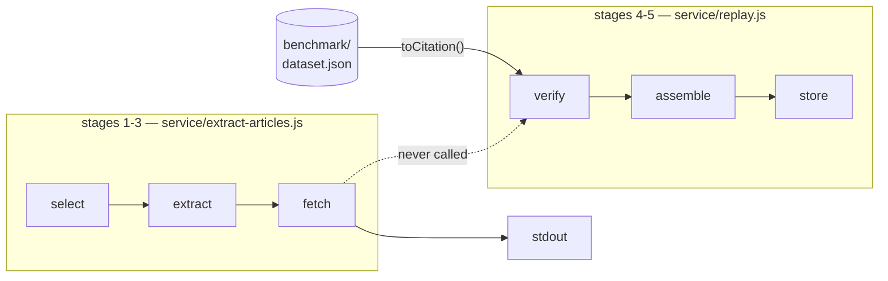
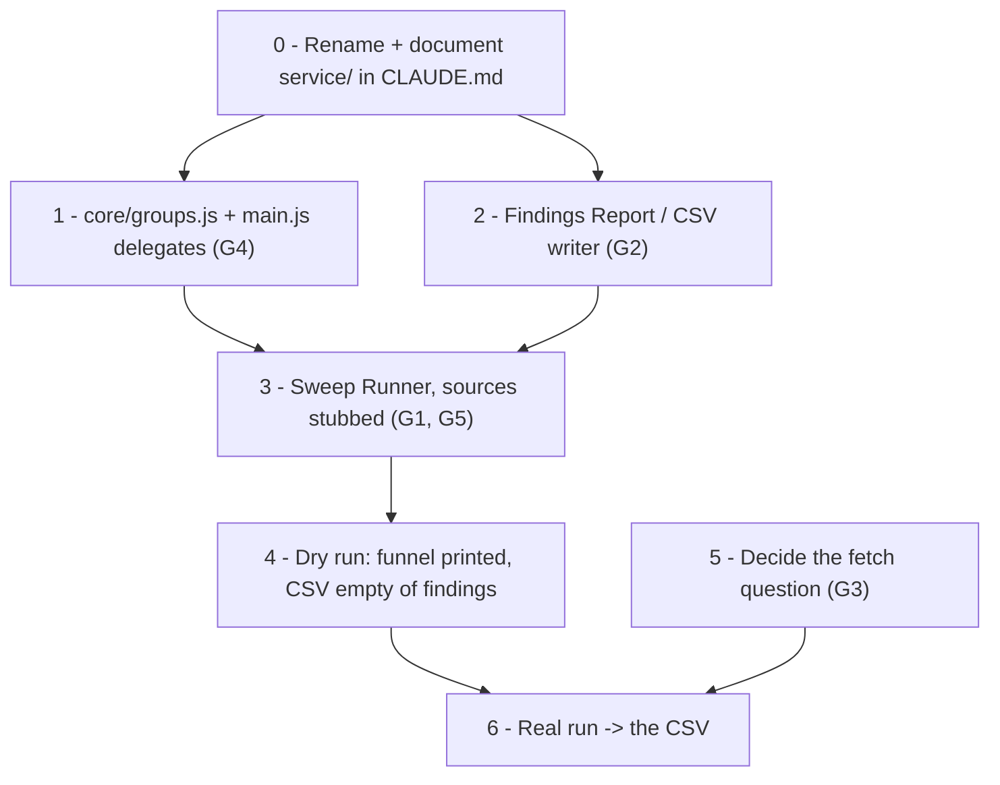

# One command, one shareable CSV — what's left, and what to call it

> **Status (2026-08-24):** Proposed. Two questions, answered together because
> the second is why the first is hard to see: (a) what remains before
> `select → fetch → verify → CSV` runs as one command, and (b) what the
> components of that pipeline should be *called*, so the parts stop blurring
> into each other.
>
> No implementation. Sizes and risks below are estimates against the code as
> it stands on `dev` at `d523762`.

## The goal, stated in pipeline terms

> *I run a script and I get a CSV at the end that I can share. Everything from
> article selection to source fetching to LLM calls happens in between.*

That is the parent design doc's stages 1→5, plus a **CSV instead of stage 6's
read API**. Substituting the CSV is a good move and worth saying why out loud:
the API's whole purpose is to serve findings to a surface that does not exist
yet and whose contract (open question 3, wikitext offsets) is still unanswered.
A CSV serves the two audiences that *do* exist today — the maintainer auditing
precision, and the Foundation being shown a result — and it needs no hosting,
no auth, and no schema agreement with anybody.

So stage 6 shrinks from "a read API" to "a file writer," and the critical path
gets shorter.

## Where the pipeline actually stands

Every stage is built. The pipeline still doesn't run, and the reason is
narrower than it looks.

| Stage | State | Where | Proven against |
| --- | --- | --- | --- |
| 1 Select | **Built** | `service/selection.js`, `replicas.js`, `select-articles.js` | Real Wiki Replicas |
| 2 Extract | **Built** | `service/pipeline.js`, `core/citations.js`, `core/claim.js` | Real article HTML |
| 3 Fetch | **Built, stubbed by default** | `tf-source-fetcher`, `--live-source-fetch` | One manual smoke test |
| 4 Verify | **Built** | `service/verify.js` | Real Lift Wing calls (2026-08-24) |
| 5 Store | **Built** | `service/assemble.js`, `findings.js`, `toolsdb.js` | Real ToolsDB writes, ids 36–40 |
| 6 Export | **Nothing** | — | — |

### The seam that has never been crossed

Phase 4's doc described the gap as "a missing *call*" in the middle of the
pipeline. That call got made — but only on one side of it.



`service/extract-articles.js` runs stages 1–3 and prints. `service/replay.js`
runs stages 4–5 and writes to ToolsDB — but its input is
`benchmark/dataset.json`, not stage 3's output. **The two halves have never run
in the same process.**

The good news is in `service/replay.js:147`. Its `toCitation()` reshapes a
dataset row into, by its own comment, *"the shape `service/pipeline.js`'s
`processArticle` produces for a live-fetched citation."* The contract on both
sides of the seam was written to match. Feeding the real thing in is therefore
a smaller job than building the fake was — the runner is glue, not design.

`service/run-pipeline.js` is named three times in the phase-4 doc (§3, §8
branch 5, §9 validation 4) as the thing that joins them. Branch 5 landed
`assemble.js` and `replay.js` and stopped there. It was never built.

## What remains

Ordered by what blocks the CSV. Only two of these are more than glue.

### G1 — The sweep runner · Medium · the actual missing piece

`service/run-pipeline.js`: `selectCandidates` → `runBatch` → `verifyCitation` →
`assembleFinding` → sink. Every one of those functions exists, is exported, and
is unit-tested. What the runner adds is the loop, the funnel counters, the halt
rule, and the CSV sink.

Three things it must not get wrong, all of them already solved elsewhere in the
repo and worth copying rather than re-deciding:

- **Persist incrementally**, per phase 4 §5. A sweep that buffers an article and
  dies loses the article; one that writes each finding as it lands loses one
  finding. `replay.js` already does this.
- **Halt on 401/402/403** from the model. `service/verify.js` exports
  `ProviderAuthError` for exactly this and `replay.js` honors it. The failure
  this prevents is real and documented: 31 of 186 calls in one benchmark run
  silently became `SOURCE UNAVAILABLE` rows after a wallet balance ran out.
- **Stay sequential.** `runBatch` is an async generator and processes one
  article at a time. Toolforge stops tools exceeding ~50 simultaneous
  connections per wiki. Don't add concurrency without a per-wiki ceiling.

### G2 — The CSV writer · Small · but it has real decisions

Nothing in `service/`, `cli/`, or `core/` writes CSV. `benchmark/generate_comparison.js`
does, for a different shape — lift its quoting rather than writing a third
implementation.

The decisions that matter more than the code:

**Where does the CSV come from — the run, or the table?** Recommend **the run
writes the CSV directly, and the ToolsDB write becomes opt-in** (`--store`).
This inverts `replay.js`'s default, deliberately: ToolsDB is only reachable
from a Toolforge bastion, and gating the deliverable on bastion access makes a
shareable artifact unnecessarily hard to produce. The CSV is what someone
actually wants; the table is where it eventually lives once stage 6 serves from
it. A later `ccs export-findings` reading ToolsDB is the repeatable version and
should exist — but it is not what unblocks the first run.

**Include a permalink column.** This is the difference between a CSV and a
*shareable* CSV: a reviewer reading a row needs to click through to the claim
in the revision it was judged against. `https://en.wikipedia.org/w/index.php?curid={page_id}&oldid={revision_id}`.

**Include the rows where no model ran.** No URL, fetch failed, source
unavailable — all of them. §7 of the parent doc argues for the denominator
being visible, and a CSV that silently drops the uncheckable citations
overstates coverage to exactly the audience most likely to be misled by it.

**Drop the hashes, keep the provenance.** `claim_hash` / `source_url_hash` are
internal anchors and mean nothing to a reader. `provider`, `model`,
`prompt_version`, `quote_status` and the token counts all stay — they are what
makes a disputed row diagnosable three weeks later.

**Sort by page, then citation number**, so two runs diff cleanly.

### G3 — Live source fetching, on for real · policy, not code

Stage 3 defaults to a stub, and `--live-source-fetch` exists only on
`extract-articles.js`. Threading the flag through the new runner is trivial. The
non-trivial part is that **with the stub, every row in the CSV is
`SOURCE UNAVAILABLE`** — the deliverable is empty of findings.

The honest position: the parent doc calls a handful of manual requests while
exploring "ordinary development, categorically unlike an unattended crawler."
A one-off attended run over ~50 articles is somewhere between that and the
thing WMCS was asked about, and it is worth deciding which side of the line
you want to be on *before* the run rather than defending it after. Two ways
through, both legitimate:

- Run it small and attended, from a laptop rather than Toolforge, and say so in
  the CSV's provenance. This is the funnel measurement the parent doc's Track B
  step 5 explicitly wanted done off-platform and un-gated.
- Wait for the WMCS answer and run it from Toolforge.

Track B step 5 was never done. The first option is that step, with a better
output than the throwaway script it originally called for.

### G4 — Collective verification for adjacent groups · Medium · **the one correctness gap**

`core/citations.js:94` already emits `groupId`, `groupSize` and `groupIndex`.
`service/verify.js` says in its own header that it implements the solo path
only, and that this is fine because *"benchmark/dataset.json, the replay corpus
this module exists to run against first, has no grouped citations."*

That reasoning expires the moment the input becomes real articles. **Real
articles have adjacent citation groups**, and on those the pipeline will emit
per-source verdicts — which is precisely what the collective design
(`docs/design-plans/2026-06-23-collective-group-verification.md`) exists to
prevent, because per-source verdicts on grouped citations mislead. A claim
supported jointly by three citations reads as three separate failures.

`core/groups.js` (phase 4 branch 2) and `main.js` delegating to it (branch 6)
were both deferred and are now load-bearing. Four rules currently live only
inside `main.js` — group-close detection, member dedup, the skip-at-≤1-source
rule, and `getReportUnits()`'s merge — and rule 4 is the one that decides which
row the CSV should contain.

This is the only item on the list that produces *wrong output* rather than
*no output*, and it is the reason to do it before the first real run rather
than after.

### G5 — The funnel · Small

`extract-articles.js` counts `citations → withUrl → fetched → failed`. The §7
funnel wants `→ verified → flagged → published` on the end. The runner should
print the whole thing to stderr. This is cheap and it is what makes the CSV
interpretable: "412 rows, 38 flagged" means nothing without the denominators
behind it.

### G6 — `ref_name` is never collected · Small

`core/citations.js` doesn't extract it; `assemble.js` passes
`citation.refName ?? null`, so the column is always NULL. §2 names it as half
the citation anchor ("the source URL, plus the `<ref name="...">` when
present"). Fine to leave NULL for a CSV run, worth fixing before the anchor is
relied on for read-time resolution.

### G7 — The publication filter · deferred, correctly

Track B step 4 was never done: `analyze_results.js` still reports four-class
exact accuracy, not flag-class precision or a precision-vs-confidence curve.
Everything the pipeline writes is `published = 0`.

For a CSV this is not a blocker — arguably the sequencing is backwards in a
useful way. Ship every row, let a human read them, and **the CSV becomes the
instrument that produces the threshold** rather than something gated on it.
Say so in the file: a `published` column that is 0 on every row invites the
question, and the answer is "nothing has been through a filter yet."

## Summary

| | Gap | Size | Blocks the CSV? |
| --- | --- | --- | --- |
| G1 | Sweep runner joining stages 1–5 | Medium | **Yes** |
| G2 | CSV writer | Small | **Yes** |
| G3 | Live fetching turned on | Policy | **Yes** — stub ⇒ empty CSV |
| G4 | Collective group verification | Medium | No — but output is wrong without it |
| G5 | Full funnel accounting | Small | No |
| G6 | `ref_name` collection | Small | No |
| G7 | Publication filter | — | No — deliberately deferred |

Nothing here is architecturally hard. G1 and G2 are glue over code that is
already proven against real infrastructure; G4 is a verbatim lift out of
`main.js` that was deferred for a reason that no longer holds; G3 is a decision
rather than a build.

---

## Naming: why parts blur together

The confusion is real and mostly structural. Six causes, all fixable:

**`service/` is absent from CLAUDE.md entirely.** The Project Structure section
lists `main.js`, `core/`, `cli/`, `scripts/`, `tests/`, `benchmark/`, `docs/` —
and stops. Thirteen files and the entire Toolforge pipeline are undocumented in
the file whose job is orientation. This is likely the single largest
contributor to losing track, and it is the cheapest thing on this page to fix.

**`service/pipeline.js` is not the pipeline.** It is stages 1–3. The actual
pipeline runner doesn't exist. The most general name in the directory is
attached to one of its narrower parts.

**Three different things are called "verify."** `service/verify.js` (stage 4),
`cli/verify.js` (the single-citation CLI), and `verifyClaim()` in `main.js`.

**The logic/script split uses two different conventions.** `selection.js` /
`select-articles.js` for stage 1; `pipeline.js` / `extract-articles.js` for
stages 2–3. Same relationship, no shared pattern, so neither name teaches you
the other.

**One component is spread across three files with unrelated names.**
`assemble.js` (builds the row), `findings.js` (the SQL), `toolsdb.js` (the
connection) are one thing — the findings store.

**Only the two external tools have real names.** `tf-llm-router` and
`tf-source-fetcher` read as components because they were named as components.
Nothing inside `service/` was.

## Proposed names

One noun per component, and `run-*.js` for anything executable. The rule is:
**if you can run it, its name starts with `run-`; otherwise its name is a
thing.**

| Stage | Component name | Today | Proposed |
| --- | --- | --- | --- |
| 1 | **Article Picker** | `selection.js` + `replicas.js` | `article-picker.js` + `replicas.js` |
| 2 | **Claim Extractor** | `pipeline.js` | `claim-extractor.js` |
| 3 | **Source Fetcher** | `tf-source-fetcher` + inline client | keep, lift client to `source-fetcher.js` |
| 4 | **Verifier** → **LLM Router** | `verify.js` + `tf-llm-router` | `verifier.js` + keep |
| 5 | **Findings Store** | `assemble.js` + `findings.js` + `toolsdb.js` | `finding-builder.js` + `findings-store.js` + `toolsdb.js` |
| 6 | **Findings Report** | — | `csv-report.js` |

And the runnables:

| Runner name | Does | Today | Proposed |
| --- | --- | --- | --- |
| **Sweep Runner** | 1→6 over real articles | — | `run-sweep.js` |
| **Replay Runner** | 4→6 over `dataset.json` | `replay.js` | `run-replay.js` |
| **Extraction Probe** | 1→3, diagnostic only | `extract-articles.js` | `run-extract.js` |
| **Picker Probe** | 1, diagnostic only | `select-articles.js` | `run-pick.js` |

`replicas.js` and `toolsdb.js` keep their names — they are named for the
external system they connect to, which is already the clearest thing they could
be called.

Two names worth defending specifically:

- **"Sweep Runner"** rather than "pipeline runner": the parent doc already uses
  "sweep" for the scheduled batch job throughout, so this inherits vocabulary
  rather than inventing it.
- **"Findings Report"** rather than "CSV exporter": the format is an
  implementation detail that will plausibly grow a JSON or HTML sibling, the
  way `benchmark/render_compare.js` did. Naming the component after its output
  format would date it.

### Rename cost

Mechanical. References per module, across code, tests and docs:

```
selection.js  9    replicas.js  9    pipeline.js  8
verify.js     6    findings.js  6    replay.js    4
assemble.js   3    toolsdb.js   3
```

Mostly test imports and design-doc prose. **Do it as one standalone commit
before G1 lands** — otherwise the new runner gets written against names that
are about to change, and the rename diff then hides real logic inside it.

## Suggested sequence



Step 0 first because everything after it touches the names. Step 1 before
step 3 because a sweep that emits per-source verdicts on grouped citations
produces a CSV that is confidently wrong in a way nobody reviewing it will
catch. Step 4 is worth doing on its own — a stubbed run proves the whole chain
and the funnel arithmetic while costing nothing and touching no publisher, and
it is the last point at which a bug is cheap to find.

Step 5 is the only item on the page that isn't engineering, and it is the only
one that can't be started today.
