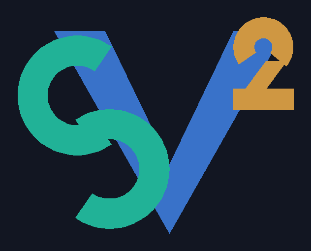
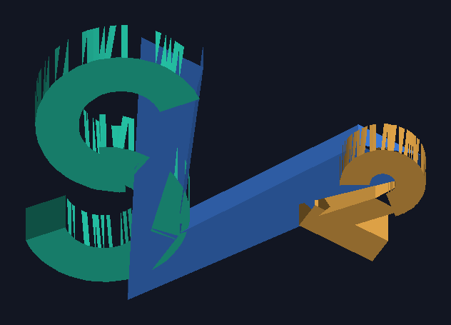

# Source Verifier — 3D-printable "SV" logo

A print-ready logo with the letters **S** and **V** interleaved. The letters
lie flat and are the object themselves — there is no separate base plate.




## Assets

All generated logo artifacts live under `assets/logo/`:

```
assets/logo/
  sv_logo.stl                          # printable 3D mesh (mm)
  sv_logo.svg                          # vector lockup (SV² + wordmark)
  renders/
    sv_logo_top.png                    # top-down preview
    sv_logo_iso.png                    # isometric preview
    sv_logo_front.png                  # flat front view (white bg)
    sv_logo_front_transparent.png      # hi-res, transparent (for apparel)
    sv_logo_front_white_hires.png      # hi-res, white background
```

## Scripts

| Script | Purpose |
|------|---------|
| `scripts/generate_sv_logo.py` | Builds `assets/logo/sv_logo.stl` from parameters. |
| `scripts/preview_sv_logo.py` | Renders the top / iso previews. |
| `scripts/render_front_white.py` | Renders the flat front-view PNGs (front / transparent / hi-res). |
| `scripts/generate_svg.py` | Builds `assets/logo/sv_logo.svg`. |

All scripts resolve paths relative to the repo root, so they can be run from
any working directory.

## Print notes

- **No base plate.** The letters lie flat and are the object; every part sits
  on the bed, so it prints **lying down with no support material**.
- The **S is built from two overlapping C-curves** (a top "(" bulging left and
  a bottom ")" bulging right) that cross in the middle.
- A small **superscript "2"** sits at the top right, like a citation reference
  ("SV²"). It overlaps the V's top corner so it stays connected.
- **Stepped thicknesses:** S = 8 mm, the "2" = 6.5 mm, V = 5 mm. Thicker
  elements read as the top layer where things overlap, so the "2" sits in the
  foreground over the V's leg.
- The two C's overlap each other, the S overlaps the V, and the "2" overlaps
  the V, so the whole mark fuses into a single connected piece.

Default dimensions: ~60 × 47 mm footprint, 8 mm tall.

## Regenerating / customizing

```bash
pip install numpy-stl pillow fonttools cairosvg   # one-time
python3 scripts/generate_sv_logo.py    # -> assets/logo/sv_logo.stl
python3 scripts/preview_sv_logo.py     # -> assets/logo/renders/*.png
python3 scripts/render_front_white.py --size 3600 --transparent  # apparel PNG
python3 scripts/generate_svg.py        # -> assets/logo/sv_logo.svg
```

Tunable constants live at the top of `scripts/generate_sv_logo.py`:

- `S_THICK` / `V_THICK` / `REF_THICK` — thicknesses of the S, V and the "2".
  Order sets the layering where things overlap; currently S (8) > REF (6.5) >
  V (5), so the "2" sits in front of the V.
- `TWO_X` / `TWO_Y` — where the superscript "2" sits (raise `TWO_Y` for a
  higher superscript; nudge `TWO_X` to keep it overlapping the V).
- `LETTER_H` — overall glyph height.
- The `s_top_C` / `s_bot_C` dicts — the two C-curves' centres, radii
  (`r_out`/`r_in` set the stroke width) and start/end angles. Move `CY_TOP` /
  `CY_BOT` closer together for more overlap between the two C's.
- `V_OFF_X` — how far the V sits over the S (how much they interleave).
